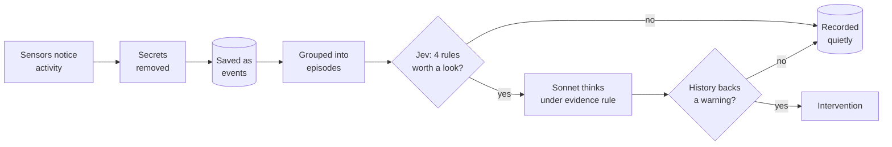

# Chapter 2: The Product

*What Grymbl is, why it exists, and one story that shows it working.*

---

## The problem

Every developer has a moment they wish someone had warned them about:

- The "harmless" refactor that quietly broke logins.
- The test that went green only after three retries, where nobody asked *why* it failed.
- The code deleted on a Friday that turned out to be holding something up.

Usually, someone *had* seen that kind of thing before. The knowledge just wasn't in the room.
Teams write postmortems and wikis, but nobody reads them at the moment it matters.

The problem has grown with **AI coding agents** ([Foundations](01_foundations.md#ai-coding-agents)).
They write a large share of code now, quickly and confidently, and they make assumptions
("nothing else uses this function") that nobody checks.

---

## The idea

> **Not AI that remembers. Software that accumulates judgment.**

Grymbl watches work as it happens, remembers what happened when similar changes were made
before, and uses that history to judge new work.

The analogy from the original plan is a **master craftsman watching an apprentice**, or a
parent teaching a kid to drive:

- They **stay silent** while things go normally.
- They **speak up only when a pattern resembles something consequential** they've seen before.
- When they speak, they **point to what they saw** ("last time you took this corner that fast,
  you nearly hit the curb"), not to vague worry.

---

## The four principles

These show up in every design decision. When in doubt, check against them.

| Principle | Meaning | How it shows up |
|---|---|---|
| **1. Silence is success** | Saying nothing is the normal, correct outcome | Two gates must both be passed before you hear anything: [Jev](03_how_it_works.md#jev), then Sonnet's evidence rule |
| **2. Evidence or nothing** | Never state a reason the facts don't support | The [evidence rule](03_how_it_works.md#sonnet): "insufficient evidence" beats a plausible guess |
| **3. Private by default** | Your code and commands stay on your machine | Everything is local; secrets are [redacted](03_how_it_works.md#redaction) before saving; only flagged, redacted episodes are ever sent out |
| **4. Never in the way** | Grymbl must not slow you down or block you | Hooks run in the background, never print, and always report success |

A fifth principle arrived with AI agents: **claims aren't evidence.** What an agent *says* it
did is checked against what it *actually* did.

---

## Who it's for

- **Now (prototype):** one developer, on their own machine, dogfooding it (using your own
  product yourself to prove it), first on a planned "dev-matching app" project.
- **Later (plan §9.2):** teams and companies, with shared memory across developers. That's
  deliberately out of scope for now.

---

## How it works in 30 seconds

It's a **funnel**: lots of cheap activity at the top, very little reaching the expensive AI at
the bottom. That makes Grymbl quiet, private, and cheap at the same time.

Each box is explained in [Chapter 3](03_how_it_works.md).

---

## A story: one change, end to end

**The setup.** You're building an app. `app/auth.py` handles logins. `tests/test_auth.py`
checks it works. Three weeks ago, a change to `auth.py` broke "remember me" logins, and Grymbl
recorded that episode. You now ask Claude Code: *"make login tokens expire after one hour."*

| # | What happens | What Grymbl does | Explained in |
|---|---|---|---|
| 1 | You send the request | Claude Code's hook passes your prompt to Grymbl. It's saved (redacted) as the **intent** of a new episode | [Sensor 5](03_how_it_works.md#sensor-5-coding-agents) |
| 2 | Claude edits `app/auth.py` | The file watcher sees the content change and saves the diff. Claude Code's hook reports that the agent made the edit | [Sensor 1](03_how_it_works.md#sensor-1-the-file-watcher) |
| 3 | Claude runs the tests. They fail | The command, its failing exit code, and the end of its output are saved, redacted | [Redaction](03_how_it_works.md#redaction) |
| 4 | Claude fixes something; the tests pass | Saved too. All of these join the same episode | [Episodes](03_how_it_works.md#episodes) |
| 5 | Claude finishes: *"Done. I assumed tokens are only checked at login."* | Its written account is saved, labelled as a *claim* | [Sensor 5](03_how_it_works.md#sensor-5-coding-agents) |
| 6 | Five quiet minutes pass | The episode closes | [Episodes](03_how_it_works.md#episodes) |
| 7 | — | **Jev** checks its rules. "Failed, then retried, then passed" fires. The episode escalates | [Jev](03_how_it_works.md#jev) |
| 8 | — | **Sonnet** reads the evidence, *including the episode from three weeks ago*, because it touched the same file | [Sonnet](03_how_it_works.md#sonnet) |
| 9 | — | History backs a warning, so Sonnet writes one: *"Last time auth.py's token logic changed, remember-me sessions broke (episode 1a2b…). The agent assumed tokens are only checked at login; nothing here verifies that."* | [Interventions](03_how_it_works.md#interventions) |
| 10 | — | The episode, its summary, and the assumption (marked `unverified`) join the **Experience Graph**, ready to inform the next change to `auth.py` | [Storage](03_how_it_works.md#storage) |

**Without the history in step 8, step 9 would be silence.** Sonnet would record what happened
and stop. That's the normal case.

### It really does this

On 2026-09-24, a real test ran on a smaller version of this scenario. An AI agent (Claude Haiku)
was asked to delete a function, and claimed *"no other code depends on the `check` function"*
(false: a test used it). Sonnet's actual analysis:

> *"The agent's stated assumption (no other code depends on check) was not verified by any
> search or grep of the codebase in the events."*

And because there was no earlier history of trouble, **it wrote no warning**. That's the
design working: it noticed the gap, recorded it, and stayed quiet. Cost: about half a US cent.

---

## What Grymbl is not

| It is not… | Because… |
|---|---|
| A chatbot | It doesn't wait for questions. It watches and rarely speaks |
| A linter or code reviewer | It judges *patterns in the work*, informed by history, not code style |
| A surveillance tool for managers | It runs for the developer, on the developer's machine. Team features are deliberately later, and the plan flags privacy design for that |
| Always right | It can only use the evidence it has. When evidence is thin, it's built to say so |

---

## Version 1 scope, at a glance

**In** (all built): the file watcher, terminal hooks for 3 shells, git hooks, test-run capture
for 3 test tools, AI-agent capture for Claude Code, local secret redaction, exact-duplicate
filtering, episode grouping, Jev's 4 rules, the SQLite Experience Graph, Sonnet under the
evidence rule, warnings to a local file, and cost caps.

**Deliberately later** (plan §8): editor plugins, "near-duplicate" detection, meaning-based
grouping, multi-developer and team memory, a graph database, trained severity scoring.

Full status: [Chapter 9](09_status_and_roadmap.md).

---

Next: [Chapter 3: How It Works](03_how_it_works.md). Copyright © 2026 Maurya Oganja. All rights reserved.
