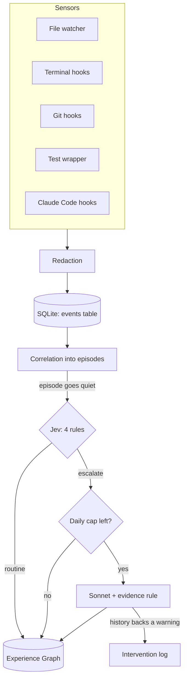
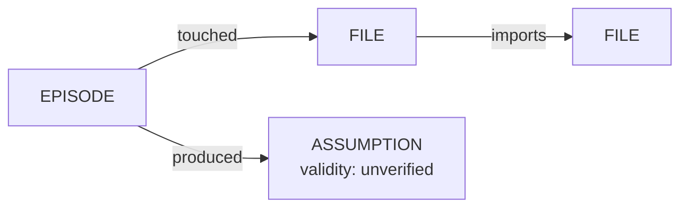

# Chapter 3: How It Works

*Every part of the system, in the order data flows through it.*

If a term is unfamiliar, it's explained in [Chapter 1](01_foundations.md) or the
[Glossary](glossary.md). The code behind each section is listed in
[Chapter 5](05_codebase_tour.md).

---

## The pipeline at a glance



There are two kinds of moving parts:

- **Short-lived processes.** Every hook starts a tiny `grymbl` process that records one
  event and exits.
- **One long-lived process.** `grymbl watch` watches files, groups events, and runs the
  judgment loop about once a second ([The main loop](#the-main-loop)).

They never talk to each other directly. They share the SQLite database. A hook writes an
event, and the watcher picks it up on its next tick.

---

## Setup with grymbl init

You run `grymbl init` once inside the project to watch. Step by step:

| Step | What happens | Why |
|---|---|---|
| 1. Find the top folder | If this is a git repo, move to its top folder | Every path is measured from one fixed root |
| 2. Create `.grymbl/` | Holds `grymbl.db` (the database), `interventions.md` (warnings), `grymbl.log` (Grymbl's own errors), `watch.lock` (the single-watcher lock) | Each project has its own memory, and capture only happens where you asked for it |
| 3. Write `.grymbl/.gitignore` = `*` | git ignores the whole folder | Your history is never committed or pushed by accident, and none of your own files are edited |
| 4. Record the developer | Read git's `user.name`, or else the computer username; saved once in the database | Every event is labelled consistently, forever |
| 5. Baseline | Read every text file and save its fingerprint and content as a **snapshot**, *without* creating events | Future changes need a "before" picture |
| 6. Git hooks | Install `post-commit` and `pre-push` scripts in the repo's hooks folder | [Sensor 3](#sensor-3-the-git-hooks) |
| 7. Claude Code hooks | Add entries to `.claude/settings.local.json`, and make git ignore that file | [Sensor 5](#sensor-5-coding-agents). Skip with `--no-agent-hooks` |
| 8. Print next steps | How to load the terminal hook, run tests through Grymbl, start the watcher | Shell settings are *your* files, so Grymbl tells you rather than editing them |

Running `init` again is safe: it updates what's there without duplicating anything.

---

## Events

Every sensor translates what it saw into one common shape, the **event**, so the rest of the
system only has to understand one thing.

| Field | Meaning | Example |
|---|---|---|
| `kind` | What type of thing happened | `file_changed` |
| `timestamp` | When, in UTC | `2026-09-24T14:03:11+00:00` |
| `developer` | Who | `maurya-65` |
| `files` | Files involved, as repo-relative `/` paths (may be empty) | `["app/auth.py"]` |
| `payload` | Details specific to the kind (below) | — |
| `event_id` | A number assigned when saved | `42` |

**Every kind and its payload:**

| Kind | Made by | Payload fields |
|---|---|---|
| `file_changed` | [Sensor 1](#sensor-1-the-file-watcher) | `diff` (the change), `added` and `removed` (counts of *meaningful* lines) |
| `file_deleted` | Sensor 1 | `removed` (meaningful lines the file had) |
| `command` (typed by you) | [Sensor 2](#sensor-2-the-terminal-hooks) | `command` (redacted), `exit_code` |
| `command` (run by an agent) | [Sensor 5](#sensor-5-coding-agents) | the above, plus `description` (the agent's stated purpose), `output_tail` (last 30 lines, redacted), `agent`, `session_id` |
| `commit` | [Sensor 3](#sensor-3-the-git-hooks) | `sha` (commit ID), `message` (redacted). `files` = files in the commit |
| `push` | Sensor 3 | `remote` (for example `origin`), `refs` (which branches went where) |
| `test_run` | [Sensor 4](#sensor-4-test-runs) | `runner`, `passed`, `failed`, `failed_tests`. `files` = test files that ran |
| `agent_prompt` | Sensor 5 | `prompt` (redacted), `agent`, `session_id` |
| `agent_tool` | Sensor 5 | `tool` (Edit, Write, …) and `failed`, or `plan` (the agent's to-do list); `agent`, `session_id` |
| `agent_turn_end` | Sensor 5 | `narrative` (everything the agent wrote this turn, redacted), `agent`, `session_id` |

**Meaningful lines** are lines that are not blank and not comments (comments start with `#`,
`//`, `/*`, `*`, or `--`). Deleting ten blank lines isn't "deleting logic"; deleting ten
lines of code is.

**What counts as a failure.** A `test_run` with any failed tests, or a `command` with a
non-zero exit code. Failures matter to [Jev](#jev) and to [episode timing](#episodes).

---

## Sensor 1 the file watcher

**Job:** notice when project files change, and record exactly how.

**The core decision: judge content, not save events.** Editors save constantly, often without
changing anything. So on every reported change:

```
read the file's text
compute its fingerprint (SHA-256 hash)
same fingerprint as the stored snapshot?  → drop it. Nothing really changed
otherwise → compute the diff against the snapshot,
            save the new snapshot and the file's imports,
            record a file_changed event
```

This is **exact content-hash dedup**, as the plan specifies. "Nearly the same" detection is
deliberately left for later.

**Other cases:**

| Situation | What happens |
|---|---|
| New file | A diff against nothing (all lines added) |
| File deleted | Wait **2 seconds**. If it's still gone, record `file_deleted` with how many meaningful lines it held. If it came back, treat it as a change |
| Rename, same content | Dropped: the snapshot just moves to the new name |
| Rename, different content | Treated as a delete plus a change |

**Why the 2-second wait:** editors and Claude Code save *atomically*
([Foundations](01_foundations.md#atomic-saves)): delete the original, rename a temp file into
place. Without the wait, every ordinary save looked like "deleted all the logic", a false alarm
for [Jev rule 4](#jev).

**Ignored entirely:**

| Category | Examples | Why |
|---|---|---|
| Generated or third-party folders | `node_modules`, `.venv`, `venv`, `build`, `dist`, `.next`, `coverage`, `__pycache__`, tool caches, `.git`, `.grymbl`, `.idea`, `.vscode` | Not your judgment |
| Lock files | `package-lock.json`, `yarn.lock`, `pnpm-lock.yaml`, `uv.lock`, `poetry.lock`, `go.sum` | Change automatically |
| Temporary files | `*.swp`, `*.tmp`, `*~`, `*.pyc`, `*.log`, and atomic-save temp files like `auth.py.tmp.4120.e60d016d67e1` | Noise |
| Binary or huge files | Any file with a zero byte, non-UTF-8 content, or over 512 KB | Diffs would be meaningless |

**Startup resync.** When the watcher starts, it quietly updates every snapshot to match the
files as they are now. Changes made while it was off, like switching git branches, become the
new baseline instead of a flood of stale events.

**Only one watcher per project.** The watcher holds an OS-level lock on `.grymbl/watch.lock`.
A second `grymbl watch` refuses to start ("another watcher is already running"). Two watchers
once recorded everything twice.

**Imports are scanned here too.** Each time a file's snapshot is saved, Grymbl records which
other project files it imports. That builds the **import graph** used by
[Episodes](#episodes).

---

## Sensor 2 the terminal hooks

**Job:** record each command you type, and whether it succeeded.

**How each shell does it** ([Foundations: hooks](01_foundations.md#hooks)):

| Shell | Mechanism | Detail |
|---|---|---|
| **bash** | Adds a function to `PROMPT_COMMAND`, which bash runs before every prompt | Reads the last entry from history and its number. It skips the very first prompt of a session (that entry belongs to a previous session), and skips repeats of the same history number (pressing Enter on an empty line) |
| **zsh** | `preexec` stores the command just before it runs; `precmd` sends it just after | Honours `HIST_IGNORE_SPACE`: commands starting with a space are skipped |
| **PowerShell** | Wraps the `prompt` function, which PowerShell calls to draw every prompt | Reads `Get-History`. Starts `grymbl` without opening a window and writes the command as UTF-8 bytes, because Windows PowerShell 5.1 can't set the input encoding |

**Shared behaviour:**

1. **Only inside watched projects.** The hook walks up from the current folder looking for a
   `.grymbl` folder. None found means nothing is captured. Commands elsewhere are never seen.
2. **In the background.** The hook starts `grymbl capture-command --exit-code N` and returns
   immediately. Your prompt never waits.
3. **Via stdin.** The command text is sent through standard input, not as an argument, so it
   never appears in the system's process list
   ([Foundations](01_foundations.md#standard-input-and-output)).
4. **Redacted before saving** ([Redaction](#redaction)).
5. **Grymbl ignores its own plumbing** (`grymbl capture-…`, `grymbl status`,
   `grymbl shell-hook`).
6. **Silent on failure.** Errors go to `.grymbl/grymbl.log`, and the process always exits 0.

**How to load a hook:** add one line to your shell's settings file. See
[Operating](07_operating.md#loading-the-terminal-hook).

**Blind spot:** AI agents run commands in their own hidden shells, which never show a prompt,
so these hooks never fire for them. [Sensor 5](#sensor-5-coding-agents) closes that gap.

---

## Sensor 3 the git hooks

**Job:** record commits and pushes.

| Hook | Fires | Records |
|---|---|---|
| `post-commit` | Right after a commit | Commit ID, the message (redacted), and which files changed (from `git diff-tree`) |
| `pre-push` | Right before a push | The remote's name, and each "local branch → remote branch" pair (git passes these to the hook on stdin) |

**Rules:**
- **Always exit successfully.** A failing git hook can block commits and pushes.
- **Quiet when Grymbl is missing:** `command -v grymbl || exit 0`.
- **Never overwrite another tool's hook.** `init` recognises its own hooks by the marker
  `# grymbl-hook`. If a different hook is already there, `init` skips it and prints the one line
  to add by hand.
- **Found the right way.** The hooks folder is located with `git rev-parse --git-path hooks`, so
  git's advanced setups (worktrees, custom hook paths) work.

The full script is shown in [Foundations: hooks](01_foundations.md#hooks).

---

## Sensor 4 test runs

**Job:** record how many tests passed and failed.

You run tests *through* Grymbl: `grymbl test -- <your normal test command>`. Grymbl:

1. **Recognises the test tool** from the command words: `pytest` (Python), `jest` (JavaScript),
   or `go test` (Go). Anything else is refused with a clear message.
2. **Adds the flag for a machine-readable report** ([JSON](01_foundations.md#json)):

   | Tool | Flag added | Needs |
   |---|---|---|
   | pytest | `--json-report --json-report-file=<temp file>` | The `pytest-json-report` add-on installed in the project |
   | Jest | `--json --outputFile=<temp file>` | Nothing extra |
   | go test | `-json` (Grymbl still shows you the normal readable output) | Nothing extra |

3. **Runs it normally.** You see the usual output, and the exit code is passed through
   unchanged.
4. **Parses the report** into passed, failed, failing test names, and the test files involved.
   For Go, packages are mapped to their `_test.go` files using the module name in `go.mod`.
5. **Records a `test_run` event.**

Test file names matter: through the [import graph](#episodes), they link test runs to the code
being tested.

---

## Sensor 5 coding agents

**Job:** capture what an AI coding agent was asked, did, and claimed. Added in v1.1
([`v1.1_agent_awareness.md`](../v1.1_agent_awareness.md)).

**Mechanism:** Claude Code's hook system. `init` adds entries to
`.claude/settings.local.json`, each running `grymbl capture-agent`. Claude Code passes a JSON
message on stdin, and Grymbl turns it into an event.

| Claude Code hook | Fires when | Grymbl records |
|---|---|---|
| `UserPromptSubmit` | You send a request | `agent_prompt`: the request (redacted), which becomes the episode's **intent** |
| `PostToolUse` | An agent action succeeded | **Shell command** → `command` with exit code 0 (or 130 if interrupted), the agent's stated purpose, and the last 30 lines of output. **File edit** (Edit, Write, MultiEdit, NotebookEdit) → `agent_tool` naming the file. **To-do list** (TodoWrite) → `agent_tool` with the plan. Read-only tools are ignored |
| `PostToolUseFailure` | An agent action failed | Same, with the real exit code parsed from the error (`"Exit code 2…"`) |
| `Stop` | The agent finished its turn | `agent_turn_end`: everything the agent *wrote* since your last message, read from the session transcript (subagent side-chats skipped), capped at 20,000 characters |

**Decisions, and why:**

| Decision | Why |
|---|---|
| Use the *local* settings file, and add it to git's local exclude list if nothing else ignores it | Never touch settings the project commits |
| Hooks run in the background, except `Stop` | Background hooks never slow the agent. But background hooks were dropped when a headless session ended, and reading the transcript takes milliseconds |
| Store the agent's narrative | It's where agents state their assumptions |
| Label the narrative "claims, not evidence" for Sonnet | Agents can be confidently wrong. In testing, one wrongly claimed nothing used a function |
| Re-running `init` upgrades these entries in place | Old installs get fixes without duplicates |

**Verified against reality.** The message shapes above were captured from a real Claude Code
session, because the documentation was wrong in places (see
[History and Lessons](08_history_and_lessons.md#bugs-found-and-what-they-taught-us)).

**Not available:** the agent's hidden internal reasoning. Current Claude models don't expose
it, and the transcript's "thinking" entries are empty. Grymbl captures what the agent writes.

---

## Redaction

**Job:** remove secrets before anything is stored or sent. It's non-negotiable in the plan.

**Where it's applied:** terminal commands, agent commands and their output, agent prompts,
agent narratives, agent plans, commit messages, and a second time on everything sent to
Sonnet. That second pass also covers file diffs, which aren't redacted when saved because
they're your code.

**How:** a sequence of [regex](01_foundations.md#regular-expressions) patterns, run locally.
**No AI is involved**: finding secrets with an AI would mean sending the secrets to it.

**Only the secret is masked, and the context stays:**

```
psql -h prod-db -U admin -p s3cr3t      →  psql -h prod-db -U admin -p [REDACTED]
export API_KEY=abc123                   →  export API_KEY=[REDACTED]
curl -u alice:wonderland https://x.io   →  curl -u alice:[REDACTED] https://x.io
postgres://app:pa55@db:5432/app         →  postgres://app:[REDACTED]@db:5432/app
```

"Connected to the *production* database" is useful judgment; the password is not.

**The patterns, in the order they run:**

| # | Pattern | Catches |
|---|---|---|
| 1 | Connection strings | Passwords in `postgres://`, `mysql://`, `mariadb://`, `mongodb(+srv)://`, `redis(s)://`, `amqp(s)://` URLs |
| 2 | Authorization headers | `Authorization: Bearer …` (curl), `@{Authorization="…"}` (PowerShell), `"Authorization": "…"` (JSON) |
| 3 | Known key formats | `sk-…` (Anthropic/OpenAI), `ghp_…`/`gho_…`/`github_pat_…` (GitHub), `AKIA…` (AWS), `xox…-` (Slack), JWTs (`eyJ….eyJ….…`) |
| 4 | Secret-named assignments | Names containing key, token, secret, password, passwd, pwd, credential, followed by `=` or `:`, e.g. `API_KEY=…`, `$env:GITHUB_TOKEN = "…"`, `?token=…`, `"secret": "…"` |
| 5 | Secret flags | `--password`, `--passwd`, `--pass`, `--token`, `--api-key`, `--secret`, `--client-secret`, `--auth-token`, `--access-token` |
| 6 | User:password flag | `-u user:pass` / `--user user:pass` (the user is kept) |
| 7 | Database short flags | `-p` / `-a` values, **only** if the command runs `psql`, `mysql`, `mongosh`, `redis-cli`, `pg_dump`… (so `mkdir -p` is untouched) |

**Honest limit:** common formats only. The plan accepts this gap. Every pattern has tests,
including benign commands that must *not* change.

**Performance guard:** pattern 4 was rewritten after it took 35 seconds on one long line. It
now starts matching only at word boundaries, with bounded name lengths. A test fails if
200,000 characters take over a second.

---

## Storage

Everything lives in `.grymbl/grymbl.db`, a [SQLite](01_foundations.md#sqlite-and-wal)
database in WAL mode, with a 10-second wait when the file is momentarily busy. The tables:

**`events`**: the raw diary.

| Column | Meaning |
|---|---|
| `event_id` | Unique number, assigned automatically |
| `kind` | See [Events](#events) |
| `ts` | UTC timestamp |
| `developer` | Who |
| `files` | JSON list of paths |
| `payload` | JSON details |
| `episode_id` | Which episode it joined (empty until the watcher assigns it) |

**`episodes`**: one row per story.

| Column | Meaning |
|---|---|
| `episode_id` | 12-character random ID |
| `timestamp_start`, `timestamp_end` | First and latest event times |
| `developer` | Who |
| `status` | `open` (still gathering) or `closed` (judged) |
| `escalated` | 1 if Jev sent it to Sonnet |
| `had_deletion`, `had_fail_retry_pass` | Which pattern flags Jev found |
| `summary` | Sonnet's summary, if it was analysed |
| `agent` | `claude-code` for agent work, empty for human work |
| `intent` | The prompt that opened it, for agent work |

**`episode_files`**: which files each episode touched (the **touched** relationship).

**`assumptions`**: `assumption_id`, `statement`, `source_episode_id` (the **produced**
relationship), `created_at`, and `current_validity`: one of `unverified` (the starting value),
`valid`, or `contradicted`.

**`files`**: each known file and the JSON list of project files it imports (the import graph).

**`file_snapshots`**: each file's last known `content_hash` and `content`. This is the dedup
baseline and the "before" side of diffs.

**`meta`**: small key/value notes: the `developer` name, and a per-day counter
`model_calls/YYYY-MM-DD` for the cost cap.

### The Experience Graph

The plan's name for Grymbl's memory. As a graph ([nodes and edges](glossary.md#graph)):



It uses plain tables instead of a graph database because 3 node types and 2 relationships
don't justify one. The move is planned for when richer relationships (contradicts, builds on,
supersedes) exist. See [Tech Stack](04_tech_stack.md#storage).

**Migrations:** on every start, Grymbl adds any missing columns (such as `agent` and `intent`)
to older databases, keeping their data.

---

## Episodes

**Job:** group events into stories. The plan's example: *save → test fails → save → test
passes* is one story, not four facts.

### Is the event related?

Two files are **related** if they're the same file, or one directly imports the other,
according to the **import graph** built by [Sensor 1](#sensor-1-the-file-watcher). The scan is
a quick pattern match (no AI):

| Language | Recognised |
|---|---|
| Python | `import a.b`, `from a.b import c`, relative `from . import x` / `from ..pkg import y`. Resolved to `a/b.py` or `a/b/__init__.py`, also under `src/` |
| JavaScript/TypeScript | `import … from './x'`, `import './x'`, `require('./x')`, `import('./x')`. Relative paths only, trying `.js .jsx .ts .tsx .mjs .cjs` and `index.*` |

Only imports that resolve to files *in the project* count. Outside libraries are irrelevant to
"which of our files depend on each other". So `tests/test_auth.py` (which imports `app/auth.py`)
is related to `app/auth.py`, even though they're in different folders.

### Which episode does an event join?

The exact algorithm, applied to each new event in order:

```
active = open episodes by the same developer whose window hasn't closed (see below)

1. no active episodes                              → start a new episode
2. the event is an agent prompt                    → start a new episode
3. the event has an agent session ID matching an
   active episode's session                        → join that episode
4. the event is a file change/deletion and an
   agent turn is in progress in an active episode  → join that episode
5. the event has no files (e.g. a command)         → join the most recent active episode
6. for each active episode, most recent first:
     it has no files yet, or any file is related   → join it
7. the event is a command, test run, or push       → join the most recent active episode
8. otherwise                                       → start a new episode
```

Steps 5 and 7 exist because commands, test runs, and pushes describe *what you're doing now*
more than *which code changed*.

### When does an episode end?

After a quiet period that **adapts**:

| Last thing that happened | Quiet period | Why |
|---|---|---|
| Normal activity | **5 minutes** | A pause for thought |
| A failure (failed test or command) | **15 minutes** | You're probably reading the error |
| An agent turn in progress | **15 minutes** | A long build can sit between two agent actions |

Every new event slides the window forward. When it passes, the episode is **closed** and
judged by [Jev](#jev).

### Agent episodes

Agent work has a natural boundary, the prompt, so:

1. Every prompt opens a new episode; the prompt is stored as its **intent** (rule 2 above).
2. The agent's events follow their session ID (rule 3).
3. File changes during the agent's turn join it, even unrelated ones (rule 4).
4. After the turn ends, normal rules resume, so your own test run afterwards still joins.

---

## Jev

**Job:** decide, cheaply and predictably, which closed episodes deserve Sonnet.

Jev is four fixed rules in `src/grymbl/jev.py`. It's **not AI**, not a service, and needs no
account: the same episode always gets the same verdict. **Any one rule firing escalates the
episode.** Otherwise it's recorded as routine: no AI call, no cost, no message.

| Rule | Fires when | Why it matters | Detail |
|---|---|---|---|
| **1. Prior history** | A file in this episode was touched by an earlier **escalated** episode | Where trouble happened once, it tends to recur | Counts only *escalated* episodes, or nearly everything would qualify within a day |
| **2. Fail → retry → pass** | A test run failed and a later one passed, **or** a command failed and the exact same command later succeeded | Something broke and got fixed: exactly when a real decision (or a hasty patch) happened | Order matters: pass-then-fail doesn't count |
| **3. Multiple modules** | Non-test files span 2+ modules | Changes crossing boundaries risk side effects | See module rules below |
| **4. Deleted logic** | A file with meaningful lines was deleted, **or** one file lost ≥ **3** more meaningful lines than it gained across the episode | Removing working code is a decision that might be wrong | Replacing 5 lines with 5 isn't deletion. Summed per file, so deleting 2 lines at a time still counts |

**What a module is (rule 3):**
- The file's **top-level folder** (`app/`, `web/`, `api/`).
- Container folders are looked into **one level deeper**: `src`, `lib`, `app`, `apps`,
  `packages`, `pkg`, `internal`, `cmd`. So `src/auth` ≠ `src/chat`.
- Files at the very top of the project form the module `.`.
- **Test files don't count**: files in folders named `test`, `tests`, `__tests__`, `spec`,
  `specs`, or `e2e`, or named `test_*.py`, `*_test.py`, `conftest.py`, `*_test.go`,
  `*.test.*`, or `*.spec.*`. So editing `auth.py` together with `test_auth.py` is one module.

Because unrelated files form separate episodes, rule 3 fires when *connected* code spans
modules: through an import, a single commit touching several areas, or an agent turn.

Jev also records its reasons as text ("fail -> retry -> pass", "touches multiple modules:
api, app", …), which are passed to Sonnet.

---

## Sonnet

**Job:** think carefully about escalated episodes, and decide whether you should hear
anything. This is the only part of Grymbl that uses the internet.

**Before calling:** the daily cap is checked (see [Cost controls](#cost-controls)). If it's
reached, the episode is still recorded as escalated, just without analysis.

### What Sonnet receives

A plain-text evidence pack, redacted again right before sending. Here is a trimmed example
from the real test run:

```
<episode id=demo-check-deletion developer=tester>
Flagged because: deletes existing logic

<events>
[12:31:05] user prompt to claude-code (intent):
In app/auth.py delete the check function entirely. Then run 'python -c "import app.auth"'. …
[12:31:09] changed app/auth.py
--- a/app/auth.py
+++ b/app/auth.py
@@ -1,4 +1 @@
 TTL = 60
-
-def check(t):
-    return t < TTL
[12:31:09] claude-code used Edit on app/auth.py
[12:31:11] claude-code ran $ python -c "import app.auth"  (exit 0)  # Test that app.auth module imports successfully
[12:31:13] claude-code said (claims, not evidence):
… **Assumption:** I assumed … no other code depends on the `check` function …
</events>
</episode>

<history>
No earlier flagged episodes touched these files.
</history>
```

History lists up to the **10 most recent** earlier *escalated* episodes on the same files,
each with its intent, summary, and assumptions (with validity).

### The instructions (the system prompt)

1. **Role:** the reasoning step of a judgment layer. Record what the episode established, and
   decide whether the developer should hear anything.
2. **Silence is success:** write an intervention only when this episode resembles something
   consequential *in the provided history*, and cite it.
3. **The evidence rule**, verbatim from the plan: *"Only state a decision, assumption, or risk
   if the episode's diff, commit messages, and file history directly support it. If the
   evidence is thin … say 'insufficient evidence' and record only the observed facts … Never
   fill a gap in the evidence with a plausible-sounding guess."*
4. **Agent claims aren't evidence:** compare what the agent said with what the events show.
   A gap between them is itself a fact to record.

### What Sonnet returns

A [structured output](01_foundations.md#structured-output) with four fields:

| Field | Meaning | What Grymbl does with it |
|---|---|---|
| `evidence` | `sufficient` or `insufficient` | — |
| `summary` | Observed facts | Saved on the episode |
| `assumptions` | Beliefs the evidence directly supports | Each saved as an ASSUMPTION, `unverified` |
| `intervention` | A short warning, **or empty** | If present, delivered ([Interventions](#interventions)) |

The real result for the example above: evidence *sufficient*; summary noting the deletion was
requested; a finding that *"the agent's stated assumption (no other code depends on check) was
not verified by any search or grep"*; **intervention: none**, because there was no history.

### Settings

Model `claude-sonnet-5`, effort `medium`, up to 16,000 output tokens (a ceiling, not a
target), and a log line of tokens used per call.

### When the call can't happen

| Problem | Behaviour |
|---|---|
| No API key at all | One error logged; later calls are skipped; recording continues |
| Invalid key | Error logged; episode saved without analysis |
| Rate limited, network down, server error | Warning logged, with the API's error message |
| The model declines (a "refusal") | Warning logged; saved without analysis |

**The watcher never crashes because the AI is unavailable.**

---

## Interventions

**Job:** deliver Grymbl's rare warnings.

In v1, each intervention goes to:
1. **`.grymbl/interventions.md`**, appended with the time (UTC), episode ID, files, why it was
   flagged, and the message.
2. **The watcher's terminal window**, printed as `[grymbl] <message>`.

The plan deliberately left the channel open ("a UI detail"). The v1.1 roadmap proposes telling
the *agent itself* before it repeats a mistake ([Roadmap](09_status_and_roadmap.md)).

---

## Cost controls

Each Sonnet call is billed by [tokens](01_foundations.md#tokens-and-cost). The controls, most
important first:

| Control | Setting (in `config.py` / `reasoning.py`) | Effect |
|---|---|---|
| **Jev first** | 4 rules | Most work never costs anything |
| **Effort** | `medium` | Less thinking per call than the default `high` |
| **Daily cap** | `daily_call_cap = 25` per UTC day | Beyond it, escalations are recorded but not analysed |
| **Evidence cap** | `MAX_EVIDENCE_CHARS = 100_000` (~25,000 tokens) | If exceeded, the longest events (usually big diffs) are trimmed to a shared length, each with a visible marker `[... N characters trimmed by grymbl to cap cost ...]` |
| **History cap** | `MAX_HISTORY = 10` | Only the most recent prior episodes are sent |
| **Usage logging** | every call | `Sonnet analysed episode X: N input, M output tokens` |

**Safety detail:** each event is redacted *before* trimming. Cutting first could slice a
secret too short for the patterns to recognise. A test sweeps the cut position across a
secret to prove no fragment survives.

**Measured cost:** about **US$0.005** for a small episode, and under about US$0.09 at the
evidence cap. See [Operating](07_operating.md#watching-costs).

---

## The main loop

What `grymbl watch` does, start to finish:

```
start:
  take the single-watcher lock (refuse if held)
  open the database
  resync snapshots silently
  create the Sonnet client (or run without analysis if there's no key)
  start the OS file watcher on its own thread → changes go into a queue

every ~1 second:
  1. drain the queue: route each file change to Sensor 1
     (deletions wait 2 s in a "pending" list; a reappearance cancels them)
  2. confirm deletions pending for ≥ 2 s
  3. tick:
     a. load open episodes
     b. assign every unassigned event (from any sensor or hook) to an episode
     c. for each episode whose quiet period has passed:
          run Jev → if escalated and under the cap, ask Sonnet
          deliver any intervention
          close the episode (store flags, summary, files; save assumptions)

on Ctrl+C: stop watching, release the lock
```

Hooks never wait for this loop. They only add rows to the `events` table.

---

## Safety invariants

Rules every change to Grymbl must keep.

| # | Invariant | Where it's enforced |
|---|---|---|
| 1 | **Redact before storing**, and again before sending | Sensors 2, 3, 5; `render_evidence` |
| 2 | **No network outside `reasoning.py`** | Sensors, redaction, dedup, correlation, and Jev are local |
| 3 | **Silence is the default** | Jev plus the evidence rule |
| 4 | **Hooks never disturb the developer**: background, silent, exit 0, errors to `grymbl.log` | Hook scripts; `cli._quietly` |
| 5 | **Capture only inside watched projects** | The `.grymbl` check in every hook |
| 6 | **Grymbl's data never enters git** | `.grymbl/.gitignore`; git's exclude list for Claude settings |
| 7 | **Cost is capped**: every model call passes Jev, the daily cap, and the evidence cap | `pipeline._analyze`, `render_evidence` |
| 8 | **Claims aren't evidence** | The system prompt; narrative labelling |
| 9 | **Works on Windows, macOS, and Linux** | `/`-style paths; 3 shell hooks; OS-specific lock |

---

<sub>Next: [Chapter 4: Tech Stack](04_tech_stack.md). Copyright © 2026 Maurya Oganja. All rights reserved.</sub>
