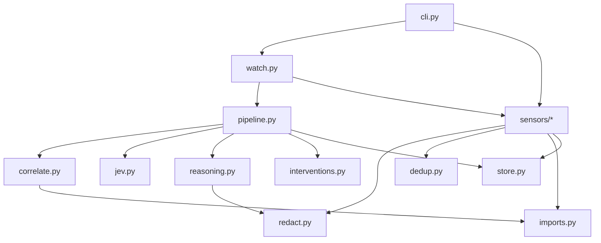

# Chapter 5: Codebase Tour

*Every file and important function, and how data travels through the code.*

Read [Chapter 3](03_how_it_works.md) first: this chapter maps those ideas onto actual code.
Function names are written like `store.add_event()`, meaning the `add_event` function in
`store.py`.

---

## The repository layout

```
Grymbl/
├── src/grymbl/                ← the product's code (a Python "package")
│   ├── __init__.py            ← marks the folder as a package
│   ├── cli.py                 ← every `grymbl …` command starts here
│   ├── config.py              ← all settings and file-ignore rules
│   ├── events.py              ← the Event shape and event kinds
│   ├── sensors/               ← code that turns activity into events
│   │   ├── __init__.py        ← developer_name(): who is working
│   │   ├── files.py           ← Sensor 1: file changes
│   │   ├── terminal.py        ← Sensor 2: typed commands
│   │   ├── git.py             ← Sensor 3: commits and pushes, hook installation
│   │   ├── tests.py           ← Sensor 4: test runs
│   │   └── agent.py           ← Sensor 5: Claude Code
│   ├── hooks/                 ← shell hook scripts, shipped inside the package
│   │   ├── grymbl.bash
│   │   ├── grymbl.zsh
│   │   └── grymbl.ps1
│   ├── redact.py              ← secret masking
│   ├── dedup.py               ← fingerprints, diffs, meaningful lines
│   ├── imports.py             ← which files import which
│   ├── store.py               ← ALL database code
│   ├── correlate.py           ← grouping events into episodes
│   ├── jev.py                 ← the 4 triage rules
│   ├── reasoning.py           ← Sonnet: evidence, prompt, API call
│   ├── interventions.py       ← writing warnings
│   ├── pipeline.py            ← one tick: assign → close → judge
│   ├── watch.py               ← the long-running watcher
│   ├── report.py              ← builds the HTML report's data
│   └── templates/
│       └── report.html        ← the report page (HTML, CSS, JavaScript)
├── tests/                     ← automated tests (one file per module)
├── docs/                      ← plan, addendum, and this guide
├── pyproject.toml             ← project definition, dependencies, tool settings
├── uv.lock                    ← exact dependency versions
├── README.md                  ← the front page
├── LICENSE                    ← ownership terms
└── .gitignore                 ← files git must ignore
```

**How the code is layered:** pure logic sits at the bottom, input/output at the top.



- **Pure modules** (`redact`, `dedup`, `imports`, `correlate`, `jev`) do no input/output: no
  files, no database, no network. They're easy to test and reason about.
- **`store.py` is the only file containing SQL.**
- **`reasoning.py` is the only file that uses the network.**

---

## Module by module

### cli.py: the front door

Every `grymbl` command enters through `main()`, which uses **argparse** to route each
subcommand to a handler:

| Handler | Command | What it does |
|---|---|---|
| `_init` | `grymbl init [path] [--no-agent-hooks]` | Setup ([Chapter 3](03_how_it_works.md#setup-with-grymbl-init)) |
| `_watch` | `grymbl watch [path]` | Starts `watch.watch()`; refuses if another watcher holds the lock |
| `_status` | `grymbl status [-n N]` | Prints recent episodes from `store.recent_episodes()` |
| `_report` | `grymbl report [--days N / --all] [-o FILE] [--no-open]` | Builds the HTML report and opens it |
| `_shell_hook` | `grymbl shell-hook bash\|zsh\|powershell` | Prints the hook script from the `hooks/` folder |
| `_test` | `grymbl test -- <cmd>` | Calls `sensors.tests.run_and_capture()` |
| `_capture_command` | *(hidden)* `capture-command --exit-code N` | Called by shell hooks; reads the command from stdin |
| `_capture_git` | *(hidden)* `capture-git post-commit\|pre-push` | Called by git hooks |
| `_capture_agent` | *(hidden)* `capture-agent` | Called by Claude Code hooks; reads JSON from stdin |

**`_quietly(capture, start)`** wraps every hidden capture command. It finds the watched project
(no `.grymbl` means it does nothing), sends logging to `.grymbl/grymbl.log`, runs the capture,
**catches every error**, and always returns 0. This is where the "hooks never disturb the
developer" invariant lives.

### config.py: settings

- **`Settings`**: a frozen dataclass holding every tunable value: `repo_root`, `idle_gap`
  (5 min), `extended_gap` (15 min), `deletion_threshold` (3), `max_file_bytes` (512,000),
  `model` (`claude-sonnet-5`), `effort` (`medium`), `daily_call_cap` (25). Its properties give
  the paths inside `.grymbl/`: `db_path`, `interventions_path`, `log_path`.
- **`find_repo_root(start)`**: walks up from a folder until it finds `.grymbl/`.
- **`to_repo_path(root, path)`**: converts any path to the repo-relative `/` form, or `None`
  if outside the repo.
- **`is_ignored(path)`**: applies `IGNORED_DIRS`, `IGNORED_NAMES`, `IGNORED_SUFFIXES`, and the
  atomic-save temp-file pattern.

### events.py: the common language

- **`EventKind`**: the list of kinds (`FILE_CHANGED`, `COMMAND`, `AGENT_PROMPT`, …).
- **`Event`**: a frozen dataclass: `kind`, `timestamp`, `developer`, `files`, `payload`,
  `event_id`. Its `failed` property is True for failing test runs and non-zero commands.
- **`utcnow()`**: the current time in UTC.

### sensors/: activity → events

| File | Key functions | Notes |
|---|---|---|
| `__init__.py` | `developer_name(store, root)` | git `user.name` or OS user, stored once in `meta` |
| `files.py` | `FileSensor.resync()`, `.on_changed()`, `.on_deleted()`, `.on_moved()` | Compares hashes with snapshots; saves snapshots and imports; records events |
| `terminal.py` | `capture_command()`, `is_self_command()` | Redacts, then records a `command` event |
| `git.py` | `capture_commit()`, `capture_push()`, `install_hooks()`, `is_git_repo()`, `git_toplevel()` | Runs `git` commands to read commit details |
| `tests.py` | `detect_runner()`, `run_and_capture()`, `parse_pytest()`, `parse_jest()`, `parse_go()`, `record_test_run()` | Parsers are pure functions over JSON, so they're easy to test |
| `agent.py` | `capture_hook()`, `turn_narrative()`, `install_claude_hooks()` | One entry point dispatching on `hook_event_name` |

### redact.py

One public function, **`redact(text)`**, which applies the seven compiled patterns in order.
Each replaces only the secret part (group 2 of each pattern) with `[REDACTED]` via
`_mask_secret`.

### dedup.py

- **`content_hash(text)`**: SHA-256 fingerprint.
- **`diff_change(path, old, new)`** → `FileChange(diff, added, removed)`.
- **`unapply(new, diff)`**: the text a diff was made from, or `None` if `new` doesn't match it.
  The report uses it to rebuild net diffs.
- **`is_meaningful(line)`** and **`count_meaningful(text)`**: not blank, not a comment.

### imports.py

- **`scan_imports(path, text, known_files)`**: finds the project files a file imports.
- **`related(a, b, graph)`**: same file, or one imports the other.

### store.py: the only database code

The **`Store`** class wraps one SQLite connection. The schema is `_SCHEMA` at the top, and
`_migrate()` adds missing columns. Methods, grouped:

| Group | Methods |
|---|---|
| Notes | `get_meta`, `set_meta`, `count_call`, `calls_on` |
| Events | `add_event` (returns the event with its ID), `unassigned_events`, `episode_events`, `file_events_since` (the report's net diffs) |
| Snapshots and the import graph | `snapshot`, `put_snapshot` (also stores imports), `delete_snapshot`, `known_files`, `import_graph` |
| Episodes | `attach_event`, `open_episode_ids`, `close_episode`, `recent_episodes`, `episodes_since` |
| Cost | `record_model_call`, `model_calls_since` |
| Memory for Jev and Sonnet | `escalated_files` (rule 1), `history_for` (Sonnet's history), `add_assumptions` |

Data shapes returned: `Snapshot`, `ClosedEpisode`, `PriorEpisode`, `EpisodeRow`, `ModelCall`.

### correlate.py

- **`OpenEpisode`**: an episode being gathered: its `events` plus derived properties `files`,
  `developer`, `last_activity`, `agent_session`, `agent`, `intent`, `agent_turn_active`.
- **`deadline(episode, settings)`**: when it closes if nothing else happens.
- **`choose_episode(event, episodes, graph, settings)`**: the joining algorithm
  ([Chapter 3](03_how_it_works.md#which-episode-does-an-event-join)). Returns an episode, or
  `None` for "start a new one".
- **`expired(episodes, now, settings)`**: the episodes to close.

### jev.py

- **`triage(events, prior_escalated_files, deletion_threshold)`** → `Triage(escalate,
  reasons, had_deletion, had_fail_retry_pass)`.
- Helpers, one per rule: `had_fail_retry_pass`, `had_deletion`, `modules_touched` (with
  `module_of` and `is_test_path`).

### reasoning.py

- **Constants:** `EVIDENCE_RULE` (verbatim from the plan), `SYSTEM_PROMPT`,
  `MAX_EVIDENCE_CHARS`, `MAX_HISTORY`, `TRIM_MARKER`.
- **`EpisodeAnalysis`**: the Pydantic model Sonnet must fill in.
- **`EpisodeEvidence`**: what gets sent: episode ID, developer, Jev's reasons, events, history.
- **`Analyst`**: a *protocol*, the required shape of anything that can analyse an episode.
  Tests supply a fake that matches it.
- **`SonnetAnalyst.analyze(evidence)`** → `AnalystResult(analysis, usage)`: the real API call,
  with all error handling. `usage` (a `Usage`: model, input and output tokens, and `cost_usd` from
  `PRICES_PER_MTOK`) is returned even when the model refuses, because refusals are billed too.
- **`render_evidence(evidence)`**: builds the text, redacting each event *then* trimming
  (`_fit`, `_trim`) to the cap.

### report.py and templates/report.html

- **`build_report(store, settings, since, now, days)`**: gathers episodes (with their events,
  assumptions, Jev rules, and warnings) and model calls, redacts every displayed text, shortens
  huge diffs (`MAX_DISPLAY_CHARS`), and embeds it all as JSON into the template.
- **`_net_changes(store, events)`**: each episode's net diff per file, rebuilt by undoing later
  diffs from the current snapshot (`dedup.unapply`). Files whose history doesn't line up, or
  whose edits interleave with another episode's, are left out.
- **`_changes`, `_stats`, `_describe`**: the files table (net diff, or each edit in turn as the
  fallback), the counts on the collapsed row, and each timeline line's title, status, and body.
- **`_embed(data)`**: escapes `<`, `>`, `&` so no content can end the `<script>` block early.
- **`templates/report.html`**: the page itself. Plain HTML, CSS (light/dark tokens), and vanilla
  JavaScript that draws the SVG charts, tooltips, tables, and filters. It inserts every string with
  `textContent`, and its Content-Security-Policy blocks all network access.

### interventions.py

- **`InterventionSink`**: a protocol, the shape of anything that can deliver a warning.
- **`MarkdownLog`**: the v1 implementation; appends to the file and prints.

### pipeline.py

- **`Pipeline.tick(now)`**: loads open episodes, assigns unassigned events (via
  `choose_episode` and `store.attach_event`), then closes expired episodes.
- **`_close(episode, now)`**: Jev → maybe `_analyze` → maybe deliver → `store.close_episode`
  → `store.add_assumptions`.
- **`_analyze(...)`**: enforces the daily cap, counts the call, calls the analyst.

### watch.py

- **`watch(settings)`**: the whole daemon ([The main loop](03_how_it_works.md#the-main-loop)).
- **`single_watcher(lock_path)`**: the OS-level lock (Windows `msvcrt`, macOS/Linux `fcntl`).
- **`_QueueingHandler`**: runs on watchdog's thread, filters ignored paths, and queues changes.
- **`FileEventRouter`**: holds deletions for 2 seconds (`DELETE_GRACE_SECONDS`) and routes
  events to the `FileSensor`.
- **`make_analyst(settings)`**: builds the `SonnetAnalyst`, or returns `None` if credentials
  can't be set up.

### hooks/: the shell scripts

Plain shell code, printed by `grymbl shell-hook`. Each defines a function that checks for a
`.grymbl` folder and pipes the last command into `grymbl capture-command --exit-code N` in the
background. Details are in [Chapter 3](03_how_it_works.md#sensor-2-the-terminal-hooks).

---

## Following the data: four journeys

### Journey 1: you type a command

```
you type:  psql -h prod -p s3cret        (in bash)
  → bash finishes the command and calls PROMPT_COMMAND → __grymbl_precmd
  → hook: inside a watched repo? yes → printf "$cmd" | grymbl capture-command --exit-code 2 &
  → cli.main → _capture_command → reads stdin (UTF-8)
  → _quietly: find_repo_root(cwd) → Store(db) → developer_name()
  → terminal.capture_command → redact() → "psql -h prod -p [REDACTED]"
  → store.add_event(Event(COMMAND, …))        ← row in `events`, episode_id empty
(later, within ~1s)
  → watch loop → pipeline.tick → choose_episode → store.attach_event
```

### Journey 2: you save a file

```
editor saves app/auth.py
  → OS notifies watchdog (its own thread) → _QueueingHandler.on_any_event → queue
  → watch loop: _drain → FileEventRouter.route("modified", path)
  → FileSensor.on_changed:
       content_hash(text) == snapshot hash?  → stop (dedup)
       else diff_change(old, new); store.put_snapshot(…, scan_imports(…))
       store.add_event(Event(FILE_CHANGED, files=("app/auth.py",), payload={diff, added, removed}))
  → pipeline.tick assigns it to an episode
```

### Journey 3: an AI agent turn

```
you send a prompt in Claude Code
  → Claude Code runs `grymbl capture-agent` with JSON on stdin {hook_event_name: "UserPromptSubmit", prompt, session_id, cwd…}
  → cli._capture_agent → _quietly(start=cwd) → agent.capture_hook → AGENT_PROMPT event
agent edits a file      → PostToolUse(Edit)   → AGENT_TOOL event  (+ the file watcher's FILE_CHANGED)
agent runs tests        → PostToolUse(Bash) / PostToolUseFailure(Bash) → COMMAND event with exit code
agent finishes          → Stop → agent._narrative() reads the transcript → AGENT_TURN_END event
  → pipeline.tick: rule 2 (prompt) opens the episode; rule 3 (session) and rule 4 (file during turn) join the rest
```

### Journey 4: an episode is judged

```
pipeline.tick(now) → expired(): quiet period passed
  → _close(episode)
      triage(events, store.escalated_files(), 3) → Triage(escalate=True, reasons=["fail -> retry -> pass"])
      _analyze(): store.calls_on(today) < 25 → store.count_call(today)
          → SonnetAnalyst.analyze(EpisodeEvidence(…, history=store.history_for(files)))
               render_evidence() → client.messages.parse(model, effort, output_format=EpisodeAnalysis)
               → EpisodeAnalysis(evidence, summary, assumptions, intervention)
      intervention? → MarkdownLog.deliver() → .grymbl/interventions.md + terminal
      store.close_episode(ClosedEpisode(summary, flags, files, agent, intent))
      store.add_assumptions(episode_id, assumptions)       ← validity "unverified"
```

---

## The tests

Each module has a matching test file in `tests/`:

| Test file | Covers |
|---|---|
| `test_redact.py` | Every secret pattern, benign commands left alone, the speed guard |
| `test_dedup.py` | Hashing, diffs, meaningful-line counting, undoing a diff (and refusing when it doesn't fit) |
| `test_imports.py` | Python and JS/TS import resolution; the `related` check |
| `test_correlate.py` | Joining rules, time windows, the agent rules |
| `test_jev.py` | Each of the 4 rules, including cases that must *not* fire |
| `test_file_sensor.py` | Dedup, renames, deletions, atomic saves, the deletion grace period, the single-watcher lock |
| `test_tests_sensor.py` | Detecting the test tool; parsing pytest, Jest, and Go reports |
| `test_agent_sensor.py` | Every Claude Code hook message (shapes copied from a real session); transcript reading; settings merge and upgrade |
| `test_pipeline.py` | Whole flows with a real SQLite database and a fake analyst; history; migration of old databases |
| `test_cost_controls.py` | The evidence cap, never leaking part of a secret, the history cap, the effort setting, the daily cap |
| `test_capture.py` | Hook entry points end to end; redaction before storage; missing-credential handling |
| `test_report.py` | Report data completeness, redaction, `</script>` break-out protection, display shortening, date ranges, net diffs and their fallback, episode counts, the command |

**Shared helpers:**
- `tests/conftest.py` provides **fixtures**, pytest's name for ready-made test ingredients:
  `settings` (a temporary project folder) and `store` (a fresh database).
- `tests/helpers.py` provides event builders: `change()`, `command()`, `ran_tests()`,
  `agent_event()`, and `at(minutes)` for timestamps.
- The fake analyst and fake warning sink live in `test_pipeline.py` (`FakeAnalyst`,
  `RecordingSink`).

**No test uses the network or costs money.**

---

## Configuration files

| File | Contains |
|---|---|
| `pyproject.toml` | Name, version, license, the 3 dependencies, the `grymbl` command entry point (`grymbl.cli:main`), dev tools, and settings for ruff (line length 100, rule sets), mypy (strict), and pytest |
| `uv.lock` | Exact versions of every dependency. Committed; never edited by hand |
| `.gitignore` | Python caches, `.venv/`, build output, `.grymbl/` |

---

<sub>Next: [Chapter 6: Developing](06_developing.md). Copyright © 2026 Maurya Oganja. All rights reserved.</sub>
