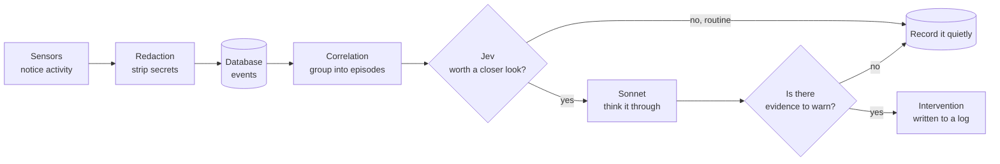
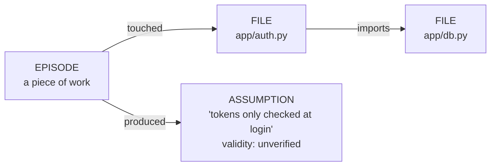

# How Grymbl Works

*A guided tour of the whole system, from the simplest idea to the smallest decision.*

> **Who this is for:** anyone, including someone who has never written code. Every technical
> word is explained the first time it appears, and each one links to the
> [Glossary](#glossary) at the end. Read top to bottom the first time. After that, jump around
> using the links.
>
> **Companion document:** [`tech_stack.md`](tech_stack.md) explains *which tools* we built this
> with, what the alternatives were, and why we chose what we did.

---

## Contents

1. [The idea in one minute](#1-the-idea-in-one-minute)
2. [The big picture](#2-the-big-picture)
3. [A story: following one change through the system](#3-a-story-following-one-change-through-the-system)
4. [Setting up: what grymbl init does](#4-setting-up-what-grymbl-init-does)
5. [Events: the common language](#5-events-the-common-language)
6. [Sensors: how Grymbl notices things](#6-sensors-how-grymbl-notices-things)
7. [Redaction: removing secrets before anything is saved](#7-redaction-removing-secrets-before-anything-is-saved)
8. [Storage: the database and the Experience Graph](#8-storage-the-database-and-the-experience-graph)
9. [Episodes: grouping events into stories](#9-episodes-grouping-events-into-stories)
10. [Jev: deciding what deserves attention](#10-jev-deciding-what-deserves-attention)
11. [Sonnet: the careful thinker](#11-sonnet-the-careful-thinker)
12. [Interventions: how Grymbl speaks up](#12-interventions-how-grymbl-speaks-up)
13. [Cost controls](#13-cost-controls)
14. [Safety rules that run through everything](#14-safety-rules-that-run-through-everything)
15. [The commands you can run](#15-the-commands-you-can-run)
16. [Map of the code](#16-map-of-the-code)
17. [Decision log: the small choices and why](#17-decision-log-the-small-choices-and-why)
18. [What is not done yet](#18-what-is-not-done-yet)
19. [Glossary](#glossary)

---

## 1. The idea in one minute

**In plain words:** Grymbl watches you (or an AI assistant) write software, and remembers what
happened. Most of the time it says nothing. It speaks up only when what you are doing now looks
like something that caused trouble before, and when it does, it shows its proof.

**The analogy the product is built on:** think of an experienced mentor, or a parent watching
a kid learn to drive. They don't comment on every turn. They stay quiet while things go
normally, and they say "careful, last time you did this at this corner, you nearly hit the curb"
only when it matters, and only because they actually saw it happen.

Two phrases from the original plan capture the product:

- *"Not AI that remembers. Software that accumulates judgment."* Many AI tools remember facts.
  Grymbl remembers **what happened when certain kinds of changes were made**, and uses that
  history to judge new changes.
- *"Silence is a successful outcome."* If Grymbl says nothing, it is working. A tool that talks
  all the time trains you to ignore it.

**Where it runs:** entirely on your own computer. Nothing is sent anywhere except the rare
moments when a flagged situation is shown to an AI model ([Sonnet](#sonnet)) for analysis, and
even then, secrets are stripped out first (see [Section 7](#7-redaction-removing-secrets-before-anything-is-saved)).

---

## 2. The big picture

Grymbl is a **pipeline**: information flows through a series of stages, and each stage does
one job and hands its result to the next.



In words:

1. **[Sensors](#sensor)** notice things: a file changed, a command ran, a commit was made, tests
   ran, an AI coding agent did something. ([Section 6](#6-sensors-how-grymbl-notices-things))
2. **[Redaction](#redaction)** removes passwords and keys from anything that might contain
   them. ([Section 7](#7-redaction-removing-secrets-before-anything-is-saved))
3. Each observation becomes an **[event](#event)** saved in a small local
   **[database](#database)**. ([Sections 5](#5-events-the-common-language) and
   [8](#8-storage-the-database-and-the-experience-graph))
4. **[Correlation](#correlation)** groups related events into an **[episode](#episode)**, the
   "story" of one piece of work. ([Section 9](#9-episodes-grouping-events-into-stories))
5. **[Jev](#jev)**, a set of four simple rules, decides whether an episode is routine or
   deserves a closer look. ([Section 10](#10-jev-deciding-what-deserves-attention))
6. Only flagged episodes go to **[Sonnet](#sonnet)**, an AI model, which must follow a strict
   **[evidence rule](#evidence-rule)**. ([Section 11](#11-sonnet-the-careful-thinker))
7. If Sonnet finds real, history-backed reason for concern, an
   **[intervention](#intervention)** (a warning) is written.
   ([Section 12](#12-interventions-how-grymbl-speaks-up))

The key design idea is a **funnel**. Lots of cheap things happen at the top (noticing,
grouping, simple rules). Very little reaches the expensive bottom (the AI model). That keeps
Grymbl fast, private, and cheap. ([Section 13](#13-cost-controls))

---

## 3. A story: following one change through the system

Before the details, here is one concrete journey. Each step links to the section that explains
it properly.

**The setup:** you are building an app. It has a file `app/auth.py` that handles logins, and a
test file `tests/test_auth.py` that checks the login code works. You ask Claude Code (an AI
coding assistant) to *"make login tokens expire after one hour."*

1. **You type the request.** Claude Code's [hook](#hook) hands your [prompt](#prompt) to
   Grymbl, which saves it as an `agent_prompt` [event](#event). This prompt becomes the
   **intent** of a new [episode](#episode): the answer to *"why did this work happen?"*
   ([6.5](#65-coding-agents), [9.3](#93-special-rules-for-ai-agents))
2. **Claude edits `app/auth.py`.** Two things notice. The [file watcher](#watcher) sees the
   file's content change and records the exact difference (a [diff](#diff)). Claude Code's
   hook also reports "I used the Edit tool on `app/auth.py`", so Grymbl knows the *agent* made
   this change, not you. ([6.1](#61-the-file-watcher))
3. **Claude runs the tests. They fail.** The hook reports the command, its
   [exit code](#exit-code) (non-zero means failure), and the last lines of output. The command
   passes through [redaction](#redaction) first in case it contained a password.
   ([7](#7-redaction-removing-secrets-before-anything-is-saved))
4. **Claude fixes something and runs the tests again. They pass.** Another event.
5. **Claude finishes and explains itself:** *"Done. I assumed tokens are only checked at
   login."* The hook hands Grymbl this [narrative](#narrative), which is saved too, marked as
   the agent's *claim*.
6. **Five quiet minutes pass.** Grymbl decides the story is over and closes the episode.
   ([9.2](#92-when-does-an-episode-end))
7. **[Jev](#jev) checks its four rules.** Rule 2 fires: tests *failed, then were retried, then
   passed*. That pattern often hides something worth understanding, so the episode is
   **escalated**. ([10](#10-jev-deciding-what-deserves-attention))
8. **[Sonnet](#sonnet) reads the evidence:** the prompt, the diff, the commands, the test
   results, the agent's claims, and any earlier flagged episodes on the same files. Suppose
   that three weeks ago a change to `app/auth.py` broke "remember me" logins, and that episode
   is in the history. ([11](#11-sonnet-the-careful-thinker))
9. **Sonnet writes an intervention**, because the history backs it: *"Last time `auth.py`'s
   token logic changed, remember-me sessions broke (episode 1a2b…). The agent assumed tokens
   are only checked at login; nothing in this episode verifies that."* It appears in
   `.grymbl/interventions.md` and in the watcher's window.
   ([12](#12-interventions-how-grymbl-speaks-up))
10. **Everything is remembered.** The episode, its summary, and the assumption *"tokens are
    only checked at login"* (marked `unverified`) join the
    [Experience Graph](#experience-graph). The next time someone touches `auth.py`, this
    episode becomes part of the history Sonnet sees.
    ([8](#8-storage-the-database-and-the-experience-graph))

If there had been **no** earlier trouble with `auth.py`, step 9 would end in silence: Sonnet
would record what happened and say nothing. **That is the normal case.**

---

## 4. Setting up: what grymbl init does

You run `grymbl init` once, inside the project you want watched. (A project folder tracked by
git is called a [repository](#repository), or "repo".) Here's what happens and why:

| Step | What happens | Why |
|---|---|---|
| Find the repo's top folder | If you're in a subfolder, Grymbl moves up to the repo's root folder | Everything is measured from one fixed starting point, so paths are consistent |
| Create `.grymbl/` | A hidden folder holding the database, the warning log, and a log of Grymbl's own errors | All of Grymbl's data lives *inside* the project it watches, so each project has its own memory |
| Write `.grymbl/.gitignore` containing `*` | Tells git to ignore everything in this folder | Grymbl's data (which may include your prompts and code history) must never be committed and pushed by accident |
| Record who you are | Reads your name from git (`user.name`), or falls back to your computer username | Every event is labeled with a developer. Stored once so it never changes mid-history |
| Take a **baseline** | Reads every file once and remembers its content, silently | Grymbl needs a "before" picture to compare future changes against. See [snapshot](#snapshot) |
| Install git hooks | Adds small scripts git runs after each commit and before each push | So commits and pushes become events ([6.3](#63-git-hooks)) |
| Install Claude Code hooks | Adds entries to `.claude/settings.local.json` | So AI agent activity becomes events ([6.5](#65-coding-agents)). Skip with `--no-agent-hooks` |
| Print next steps | Tells you how to load the terminal hook in your shell | Terminal hooks live in *your* shell settings, which Grymbl shouldn't edit on its own ([6.2](#62-the-terminal-hooks)) |

---

## 5. Events: the common language

Every sensor speaks a different "language". A file watcher knows about files, git knows about
commits, a terminal knows about commands. Grymbl translates all of them into one shape, the
**[event](#event)**, so the rest of the system only has to understand one thing.

Every event has:

| Field | Meaning | Example |
|---|---|---|
| `kind` | What type of thing happened | `file_changed` |
| `timestamp` | When, in UTC (a single world clock, so time zones never cause confusion) | `2026-09-24T14:03:11Z` |
| `developer` | Who | `maurya-65` |
| `files` | Which files it involved (may be empty) | `["app/auth.py"]` |
| `payload` | The details specific to this kind of event | the diff, the command, the test results… |

The **kinds** of events:

| Kind | Produced by | Payload holds |
|---|---|---|
| `file_changed` | [File watcher](#61-the-file-watcher) | The [diff](#diff), plus counts of meaningful lines added and removed |
| `file_deleted` | File watcher | How many meaningful lines the deleted file contained |
| `command` | [Terminal hooks](#62-the-terminal-hooks), or an AI agent's shell command | The (redacted) command and its [exit code](#exit-code). For agents, also its stated purpose and the tail of its output |
| `commit` | [Git hook](#63-git-hooks) | Commit ID and (redacted) message |
| `push` | Git hook | Which branches were pushed where |
| `test_run` | [Test sensor](#64-test-runs) | How many tests passed and failed, and the failing test names |
| `agent_prompt` | [Agent sensor](#65-coding-agents) | The (redacted) request the user gave the AI agent |
| `agent_tool` | Agent sensor | Which tool the agent used on which file, or its updated to-do plan |
| `agent_turn_end` | Agent sensor | The agent's written account of what it did: its [narrative](#narrative) |

> **Why "meaningful lines"?** A line counts as meaningful if it is not blank and not a comment.
> Deleting ten blank lines is not "deleting logic"; deleting ten lines of code is. This matters
> for [Jev's rule 4](#rule-4-deleted-logic).

---

## 6. Sensors: how Grymbl notices things

A **[sensor](#sensor)** is any part of Grymbl that observes activity and produces events. There
are five.

### 6.1 The file watcher

**What it does:** notices when files in the project change, and records exactly what changed.

**How:** the operating system (Windows, macOS, Linux) can notify a program whenever a file in a
folder changes. Grymbl uses a library called *watchdog* for this (see
[tech_stack.md](tech_stack.md#file-watching)). The watcher is part of the long-running
`grymbl watch` process, a [daemon](#daemon) you leave running in a terminal.

**The key decision: content, not save events.** Editors often "save" a file several times
without changing anything, or save the same content under a new name. If Grymbl reacted to
every save, it would drown in noise. So instead:

1. When a file changes, Grymbl reads its content and computes a **[hash](#hash)**, a short
   fingerprint of the content. Identical content always gives an identical fingerprint.
2. It compares the fingerprint with the last one it saw for that file (the
   **[snapshot](#snapshot)**).
3. **Same fingerprint → the event is dropped.** Nothing really changed.
4. Different fingerprint → Grymbl computes the **[diff](#diff)** (which lines were added and
   removed), saves the new snapshot, and creates a `file_changed` event.

This is called **exact content-hash dedup** ([dedup](#dedup) = removing duplicates). The plan
deliberately chose *exact* matching only. "Nearly identical" detection is harder and parked for
later ([Section 18](#18-what-is-not-done-yet)).

**Renames:** if a file is renamed and its content is identical, that's not a meaningful
change, so it is dropped too.

**Files it ignores:**
- Folders full of generated or third-party material: `node_modules`, `.venv`, `build`,
  `dist`, `.git`, caches, and Grymbl's own `.grymbl`.
- Lock files (`package-lock.json`, `uv.lock`, …), which change automatically and say nothing
  about your judgment.
- Temporary and backup files (`.swp`, `.tmp`, `~`, and editor temp files like
  `auth.py.tmp.4120.e60d016d67e1`).
- Binary files (images and the like), and files over 512 KB.

**Two problems found in live testing, and their fixes:**

- **[Atomic saves](#atomic-save).** Many editors, and Claude Code, save a file safely by
  writing the new version to a temporary file, deleting the original, and renaming the temp
  file into place. For a split second the file doesn't exist, and the watcher used to record
  "file deleted", which falsely triggered [Jev's deleted-logic rule](#rule-4-deleted-logic).
  **Fix:** the watcher now waits **2 seconds** before believing a deletion. If the file
  reappears, it's treated as a normal change.
- **Two watchers at once.** Running `grymbl watch` twice on the same project recorded
  everything twice. **Fix:** the watcher takes a **[lock](#lock)** (an operating-system-level
  "occupied" sign) when it starts. A second watcher sees the sign and refuses to run.

**Baseline resync:** when the watcher starts, it quietly updates its snapshots to match the
files as they are now. Changes made while it was off, such as switching git branches, become
the new starting point instead of a flood of old, misleading events.

### 6.2 The terminal hooks

**What they do:** record each command you type in your [terminal](#terminal) and whether it
succeeded.

**Why this is tricky:** there is no universal "tell me about every command" feature. Each
[shell](#shell) (the program that reads your commands) works differently. Grymbl supports
three:

| Shell | Used on | How Grymbl hooks in |
|---|---|---|
| **bash** | Linux, macOS, Git Bash on Windows | Before showing each new prompt, bash runs a setting called `PROMPT_COMMAND`. Grymbl adds itself there, reads the last command from history, and notes its exit code |
| **zsh** | macOS default, Linux | zsh has official hooks: `preexec` (just before a command runs) and `precmd` (just after). Grymbl uses both |
| **PowerShell** | Windows | PowerShell draws its prompt with a function called `prompt`. Grymbl wraps that function, and reads the last command from PowerShell's history |

You load the right one by adding a single line to your shell's settings file (see
[Section 15](#15-the-commands-you-can-run)).

**Design choices, each for a reason:**

- **Only inside watched projects.** Before doing anything, the hook checks whether the current
  folder (or one above it) has a `.grymbl` folder. If not, it does nothing. Commands you run
  elsewhere are never seen.
- **Runs in the background.** The hook hands the command to Grymbl and immediately returns, so
  your terminal never waits.
- **The command travels via "stdin", not as an argument.** Programs' arguments are visible to
  other programs on the machine (in the process list). Passing the command through the input
  stream avoids briefly exposing a secret there before [redaction](#redaction). It also avoids
  text-encoding problems between shells.
- **Privacy escape hatch.** If your shell is set to ignore commands starting with a space
  (`HISTCONTROL=ignorespace` in bash, `HIST_IGNORE_SPACE` in zsh), Grymbl respects it. Type a
  space first and the command isn't captured.
- **Never disturbs you.** If anything goes wrong, the error is written quietly to
  `.grymbl/grymbl.log`, never to your screen ([Section 14](#14-safety-rules-that-run-through-everything)).

> **Blind spot, later closed:** these hooks only fire in a terminal *you* type into. AI coding
> agents run commands in their own hidden shells, which the hooks never see. The
> [agent sensor](#65-coding-agents) closes that gap.

### 6.3 Git hooks

**[Git](#git)** is the tool that tracks versions of the project. Git lets you install
**[hooks](#hook)**: small scripts it runs automatically at certain moments. Grymbl installs two:

- **`post-commit`**: runs right after each commit. Grymbl records the commit ID, the message
  (redacted), and which files the commit touched.
- **`pre-push`**: runs just before a push (uploading commits to GitHub). Grymbl records which
  branches go where.

**Rules for these hooks:**
- **They always report success.** A hook that fails can *block* a commit or push, and
  Grymbl must never get in your way.
- **They go quiet if Grymbl isn't installed**, so a teammate without Grymbl isn't affected.
- **They never overwrite someone else's hook.** If a hook already exists and isn't Grymbl's,
  `init` skips it and tells you the one line to add yourself.

### 6.4 Test runs

**What it does:** records how many tests passed and failed each time you run the tests.

**How:** instead of running tests directly, you run them *through* Grymbl:

```
grymbl test -- pytest
grymbl test -- npx jest
grymbl test -- go test ./...
```

Grymbl recognises the test tool and adds the flag that makes it write a **structured
report**, a machine-readable [JSON](#json) file, rather than text meant for humans. Parsing
human-readable output is fragile (it changes between versions); structured reports are stable.

| Test tool | Language | Flag Grymbl adds |
|---|---|---|
| pytest | Python | `--json-report` (needs the `pytest-json-report` add-on) |
| Jest | JavaScript/TypeScript | `--json --outputFile=…` |
| go test | Go | `-json` |

The resulting `test_run` event records passed/failed counts, failing test names, and which test
files ran. Those file names help [correlation](#9-episodes-grouping-events-into-stories) link
the test run to the code being tested.

### 6.5 Coding agents

**Why this exists:** today, much code is written by AI **agents** like Claude Code rather than
typed by hand. An agent gives you something a human never does: **it says what it intends and
what it assumes.** A human's reasoning is invisible, but an agent's can be captured. This was
added as "v1.1" (see [`v1.1_agent_awareness.md`](v1.1_agent_awareness.md)).

**How:** Claude Code has its own [hook](#hook) system. `grymbl init` registers Grymbl for four
moments:

| Claude Code moment | What Grymbl records |
|---|---|
| **UserPromptSubmit**: you send a request | An `agent_prompt` event: the request, redacted. This becomes the episode's **intent** |
| **PostToolUse**: the agent used a tool successfully | For a shell command: a `command` event with the command, exit code 0, the agent's stated purpose, and the last 30 lines of output. For a file edit: an `agent_tool` event naming the file. For its to-do list: the plan |
| **PostToolUseFailure**: a tool failed | Same, but with the real failing exit code |
| **Stop**: the agent finished its turn | An `agent_turn_end` event with everything the agent wrote this turn, its [narrative](#narrative), read from the session's [transcript](#transcript) |

**Decisions and why:**

- **Local settings file** (`.claude/settings.local.json`), and Grymbl makes sure git ignores
  it. Your project's shared, committed settings are never touched.
- **Hooks run in the background ([async](#async)) except Stop.** Background hooks never slow
  the agent down. Stop runs normally because, in live testing, background hooks were dropped
  when a session ended, and reading the transcript takes milliseconds anyway.
- **Read-only tools (reading, searching files) are ignored.** They don't change anything.
- **Narrative capped at 20,000 characters per turn**, with a visible note if cut.
- **What the agent says is a claim, not evidence.** It might *say* "tests pass" when no test
  ran. Grymbl stores the narrative, but [Sonnet](#11-sonnet-the-careful-thinker) is told to
  compare claims with what actually happened. A mismatch is itself a finding.
- **The agent's hidden "thinking" isn't available.** Current Claude models don't expose their
  raw internal reasoning, so Grymbl captures what the agent *writes*.

All payload shapes were verified against a real Claude Code session, not just the
documentation, which turned out to be wrong in places.

---

## 7. Redaction: removing secrets before anything is saved

**The problem:** commands often contain secrets:
`psql -h prod-db -U admin -p s3cr3t`, `export API_KEY=abc123`, `curl -H "Authorization: Bearer …"`.
Saving these would turn Grymbl's database into a treasure chest for anyone who got hold of it.

**The rule (non-negotiable in the plan):** every command, commit message, agent prompt, agent
output, and narrative is **[redacted](#redaction)** *before* it is stored. The original is never
written anywhere.

**How:** **pattern matching**, using [regex](#regex) (a mini-language for describing text
shapes like "starts with `sk-` followed by 16+ letters"). It runs entirely on your machine with
no internet and no AI. Using an AI to *find* secrets would mean sending the secrets to the AI,
defeating the purpose.

**Mask only the secret, keep the context:**

```
psql -h prod-db -U admin -p s3cr3t      →  psql -h prod-db -U admin -p [REDACTED]
export API_KEY=abc123                   →  export API_KEY=[REDACTED]
postgres://app:pa55@db:5432/app         →  postgres://app:[REDACTED]@db:5432/app
```

Keeping the rest matters: "the developer connected to the **production** database" is useful
judgment context. The password is not.

**What it recognises:**

| Pattern | Example |
|---|---|
| Known key formats | `sk-…` (Anthropic/OpenAI), `ghp_…` (GitHub), `AKIA…` (AWS), `xox…` (Slack), JWT tokens (`eyJ….eyJ….…`) |
| Assignments with secret-sounding names | `API_KEY=…`, `DB_PASSWORD="…"`, `$env:GITHUB_TOKEN = "…"`, `?token=…`, `"secret": "…"` |
| Connection strings | `postgres://`, `mysql://`, `mongodb://`, `redis://`, `amqp://` with a password |
| Authorization headers | curl's `Authorization: Bearer …`, PowerShell's `@{Authorization="…"}`, JSON |
| Password flags | `--password`, `--token`, `--api-key`, …; `curl -u user:pass` (keeps the user) |
| Database-client short flags | `-p` / `-a` values, only when the command runs a database tool like `psql` or `mysql`, so `mkdir -p` is left alone |

**Honest limit:** this catches *common* formats, not every possible secret. The plan accepts
that gap.

**Two bugs found and fixed:**
- **PowerShell headers** (`@{Authorization="Bearer …"}`) weren't caught at first. Live
  testing exposed this, and it's fixed and tested.
- **A performance trap.** One pattern could get stuck re-trying combinations
  ([backtracking](#backtracking)) on very long lines, as in minified code: one 50,000-character
  line took **35 seconds**. It was rewritten to work in a single pass and now handles 200,000
  characters in well under a second. A test guards against this coming back.

---

## 8. Storage: the database and the Experience Graph

Everything Grymbl knows lives in one file: `.grymbl/grymbl.db`. It's a
**[SQLite](#sqlite)** [database](#database): a complete database in a single file, with no
server to run (why this choice: [tech_stack.md](tech_stack.md#storage)).

A database is organised into **tables**, like spreadsheets with fixed columns. Grymbl has
seven:

| Table | Holds | Think of it as |
|---|---|---|
| `events` | Every event from every sensor, plus which episode it belongs to | The raw diary |
| `episodes` | One row per episode: start, end, who, whether escalated, Sonnet's summary, and for agent work, the agent and the intent | Chapters of the diary |
| `episode_files` | Which files each episode touched | The index of the diary |
| `assumptions` | Beliefs recorded from episodes, each with a validity | Lessons learned |
| `files` | Each known file and which other files it imports | A map of how the code connects |
| `file_snapshots` | The last known content and fingerprint of each file | The "before" photos |
| `meta` | Small settings: the developer's name, today's model-call count | Sticky notes |

### The Experience Graph

The plan calls Grymbl's memory the **[Experience Graph](#experience-graph)**. A "graph" here
means things (**nodes**) connected by relationships (**edges**), like a family tree.



- **EPISODE --touched--> FILE** answers "what has happened to this file before?", which
  powers [Jev's rule 1](#rule-1-prior-history).
- **EPISODE --produced--> ASSUMPTION** answers "what did we believe when we changed it?"

Assumptions start as **`unverified`**. The other possible values are `valid` and
`contradicted`. Nothing changes them automatically yet ([Section 18](#18-what-is-not-done-yet)).

**Why plain tables instead of a real graph database?** With 3 kinds of node and 2 kinds of
relationship, tables do the job perfectly. A graph database (like Neo4j) is a migration for
later, when relationship types like "CONTRADICTS" or "BUILDS_ON" are needed. See
[tech_stack.md](tech_stack.md#storage).

**Two technical details:**
- **[WAL mode](#wal).** Several programs write at once: the watcher, plus every terminal and
  git hook. WAL is a SQLite setting that lets them share the file safely.
- **[Migrations](#migration).** When v1.1 added `agent` and `intent` columns, databases created
  earlier needed them too. Grymbl checks and adds missing columns automatically on startup.

---

## 9. Episodes: grouping events into stories

Raw events are just dots: *file saved, test failed, file saved, test passed.* The plan's key
insight is that these are **one story**, not four unrelated facts. Grouping events into
stories is called **[correlation](#correlation)**, and each story is an
**[episode](#episode)**.

### 9.1 The basic rule: time plus related files

An event joins an open episode if **both** are true:

1. **It happened soon enough.** Within the episode's time window (next section).
2. **It's related.** It involves a file the episode already touched, or a file *connected* to
   one.

**What "connected" means: the [import graph](#import-graph).** Code files use each other:
`test_auth.py` says `from app import auth`, meaning it *imports* `auth.py`. Grymbl reads each
file with a quick pattern scan (no AI) to find these imports, and treats two files as related
if one imports the other, even if they sit in different folders. That's why a change to
`app/auth.py` and a test run of `tests/test_auth.py` land in the same episode. This works for
Python and JavaScript/TypeScript today.

**Context events** (commands, test runs, pushes) describe *what you're doing now* rather than
which code changed, so they join the most recent active episode even without a file link.

An unrelated file change (you switch to editing documentation) starts a **new** episode.

### 9.2 When does an episode end?

After a quiet period, but the length of the quiet period **adapts**:

| Situation | Quiet period before closing | Why |
|---|---|---|
| Normal | **5 minutes** | Enough to cover a pause for thought |
| Last thing was a failure (failed test or command) | **15 minutes** | You're probably reading error output before the next change |
| An AI agent is mid-turn | **15 minutes** | A long build or test run can sit between two agent actions |

Every new related event **slides the window forward**. The plan calls this an **adaptive time
window**, as opposed to a rigid timer.

### 9.3 Special rules for AI agents

Agent work has something human work lacks: a clear starting point, **the prompt**. So:

1. **Every prompt opens a new episode.** One request = one story. The prompt is saved as the
   episode's **intent**.
2. **The agent's own events follow their session.** Each Claude Code conversation has a
   session ID, so its events always join the episode its prompt opened.
3. **File changes during an agent's turn join that turn's episode**, even if unrelated to
   earlier files, because the agent made them as part of the same request.
4. **The turn ends when the agent stops talking** (the Stop event). After that, normal rules
   resume, so if *you* then run the tests yourself, that test run still joins the story.

---

## 10. Jev: deciding what deserves attention

**[Jev](#jev)** is the gatekeeper. When an episode closes, Jev decides: **routine** (record it
quietly, done) or **escalate** (send it to [Sonnet](#sonnet) for careful thought).

**Jev is not AI.** It's four plain rules, and they're **[deterministic](#deterministic)**: the
same episode always gets the same answer. That makes Jev instant, free, predictable, and easy
to test. It's code inside Grymbl (`src/grymbl/jev.py`), not an outside service.

**An episode escalates if ANY one rule fires:**

### Rule 1: prior history

*A file in this episode was touched by an earlier **escalated** episode.*

Layman: "this spot has caused concern before." Where trouble happened once, it tends to happen
again. We chose "earlier *escalated* episodes" rather than "any earlier episode", because
otherwise nearly every file would qualify after a day of work, and every episode would
escalate.

### Rule 2: fail, retry, pass

*A test run failed and a later one passed, or a command failed and the exact same command later
succeeded.*

Layman: "something broke and got fixed." That's exactly when an interesting decision was made,
and often when a quick fix papers over a real problem.

### Rule 3: multiple modules

*The episode touches more than one **[module](#module)** (distinct part of the codebase).*

Layman: "this change reaches across boundaries." Changes spanning several areas carry more risk
of surprising side effects.

What counts as a module (decided with you):
- The **top-level folder** a file sits in (`app/`, `web/`, `api/`).
- Folders that only *contain* modules (`src/`, `lib/`, `app/`, `packages/`, `pkg/`,
  `internal/`, `cmd/`, `apps/`) are looked **one level deeper**, so `src/auth` and `src/chat`
  count as different modules. Otherwise projects using a `src/` folder could never trigger
  this rule.
- **Test files are ignored**, so editing `auth.py` together with its test `test_auth.py` is one
  module, not two. Test files are recognised by folder (`tests/`, `__tests__/`, `spec/`…) or
  name (`test_*.py`, `*_test.go`, `*.test.ts`, `*.spec.js`…).
- Files at the very top of the project count as one module named `.`.

Because unrelated files form separate episodes ([9.1](#91-the-basic-rule-time-plus-related-files)),
this rule fires when **connected** code spans modules, through imports or a single commit
touching several areas.

### Rule 4: deleted logic

*A file containing real code was deleted, or a file lost at least **3 more meaningful lines
than it gained** across the episode.*

Layman: "working code was removed." Deleting logic is a strong signal: something was decided to
be unnecessary, and that decision might be wrong. Replacing 5 lines with 5 new lines isn't
deletion; only a *net* loss counts, and it's added up across the whole episode, so deleting
2 lines at a time doesn't slip through.

**If no rule fires,** the episode is saved as routine. No AI call, no message, no cost.
**Silence by default.**

---

## 11. Sonnet: the careful thinker

When Jev escalates an episode, Grymbl asks **[Sonnet](#sonnet)** (Claude Sonnet 5, an
[LLM](#llm) made by Anthropic) to analyse it. This is the only part of Grymbl that uses the
internet.

### 11.1 What Sonnet receives

Grymbl writes out the evidence as plain text:

- **Why it was flagged** (which Jev rules fired).
- **Every event in order:** diffs, commands with exit codes, commits, test results, the agent's
  prompt (labeled *intent*), and the agent's narrative (labeled *claims, not evidence*).
- **History:** earlier *escalated* episodes on the same files, with their intents, summaries,
  and assumptions (the 10 most recent).

Everything is **redacted again** right before sending. File contents weren't redacted when
saved (they're your code), so this second pass catches secrets inside diffs.

### 11.2 The rules Sonnet must follow

The **[evidence rule](#evidence-rule)** is copied word for word from the plan:

> *Only state a decision, assumption, or risk if the episode's diff, commit messages, and file
> history directly support it. If the evidence is thin, say "insufficient evidence" and record
> only the observed facts (what changed, where), not an inferred reason. Never fill a gap in
> the evidence with a plausible-sounding guess.*

Why so strict? AI models can produce confident-sounding explanations that are simply made up
(**hallucination**). A judgment tool that invents reasons is worse than no tool. The plan notes
that on "validation night", Claude correctly said "insufficient evidence" on a broken dataset.
This rule makes that behaviour mandatory.

Two more instructions:
- **Silence is success.** Write a warning *only* if this episode resembles something
  consequential in the provided history, and cite that history.
- **Agent claims aren't evidence.** Compare what the agent *said* with what the events *show*.
  A gap between the two ("said tests pass; no passing test run exists") is a fact worth
  recording.

### 11.3 What Sonnet returns

A **[structured output](#structured-output)**: not free text, but a fixed form with four
fields, which the software can rely on:

| Field | Meaning |
|---|---|
| `evidence` | `sufficient` or `insufficient` |
| `summary` | What happened, stated as observed facts |
| `assumptions` | Beliefs the evidence directly supports. Each is saved as an ASSUMPTION node marked `unverified` |
| `intervention` | A short warning for you, **or empty to stay silent** |

### 11.4 When things go wrong

| Problem | What Grymbl does |
|---|---|
| No API key set up | Logs one message, stops trying, and keeps recording escalations *without* analysis. (Found in live testing, where it used to crash the watcher) |
| Internet down, rate-limited, server error | Logs a warning. The episode is saved as escalated, with no summary |
| The model declines to answer ("refusal") | Logs it, and saves the episode without analysis |

The watcher never crashes because the AI is unavailable.

---

## 12. Interventions: how Grymbl speaks up

An **[intervention](#intervention)** is Grymbl's rare warning. In v1 it goes to two places:

1. **`.grymbl/interventions.md`**, a running log you can read anytime, with the time, episode
   ID, files, why it was flagged, and the message.
2. **The `grymbl watch` window**, printed so you notice.

The plan deliberately treated the delivery channel (Slack, pop-ups, …) as a detail to decide
later. The v1.1 plan points at a better answer for agents: tell *the agent itself*, before it
repeats a mistake ([Section 18](#18-what-is-not-done-yet)).

---

## 13. Cost controls

Each Sonnet call costs money, billed per **[token](#token)** (a token is roughly ¾ of a word).
Sonnet 5 costs US$2 per million tokens read and US$10 per million tokens written. The controls,
from most to least important:

| Control | Setting | Effect |
|---|---|---|
| **Jev decides first** | 4 rules | Routine work (most of it) never costs anything |
| **[Effort](#effort)** | `medium` | How hard the model thinks. Medium is a large saving over the default `high`, with solid judgment |
| **Daily cap** | 25 calls per day (UTC) | Beyond that, escalations are recorded but not analysed. A hard ceiling on spending |
| **Evidence cap** | ~25,000 tokens per call | Huge diffs (generated files, big refactors) are trimmed, largest first, with a visible marker saying so |
| **History cap** | 10 most recent prior episodes | Older history adds cost more than judgment |
| **Usage logging** | every call | The watcher logs exact input and output tokens, so cost is visible |

**Estimated cost:** about US$0.025 for a typical call, and about US$0.09 at most. On 5 CAD
(about US$3.60) that's roughly 1 to 4 weeks of normal use, and never less than about
1.5 days even if every call hits the cap at maximum size.

**A safety detail:** evidence is redacted *before* trimming. Cutting a diff first could slice a
secret so short that the patterns no longer recognise it. A test checks every possible cut
position around a secret.

**Also recommended:** set a monthly spend limit in the Anthropic Console. It's a backstop no
code bug can get around.

---

## 14. Safety rules that run through everything

These rules show up in every section above. Collected here:

1. **Redact before storing.** Secrets are removed before anything is written, and again before
   anything is sent. ([7](#7-redaction-removing-secrets-before-anything-is-saved))
2. **No network except Sonnet.** Sensors, redaction, dedup, correlation, and Jev are fully
   local. ([10](#10-jev-deciding-what-deserves-attention))
3. **Silence is the default.** Two gates, Jev and then Sonnet's evidence rule, must both be
   passed before you hear anything. ([11](#11-sonnet-the-careful-thinker))
4. **Never disturb the developer.** Hooks run in the background, print nothing, always report
   success, and log failures quietly to `.grymbl/grymbl.log`.
   ([6](#6-sensors-how-grymbl-notices-things))
5. **Capture only inside watched projects.** No `.grymbl` folder, no capture.
6. **Never commit Grymbl's data.** `.grymbl/` and the local Claude settings are kept out of git.
7. **Cost is capped.** Every model call passes Jev, the daily cap, and the evidence cap.
   ([13](#13-cost-controls))
8. **Claims aren't evidence.** What an agent says is checked against what it did.
   ([6.5](#65-coding-agents))

---

## 15. The commands you can run

A **[CLI](#cli)** (command-line interface) is a program you control by typing commands.
Grymbl's commands:

| Command | What it does |
|---|---|
| `grymbl init` | Set up the current project ([Section 4](#4-setting-up-what-grymbl-init-does)). Add `--no-agent-hooks` to skip Claude Code |
| `grymbl watch` | Start the watcher and judgment loop. Leave it running in a terminal |
| `grymbl status` | Show recent episodes: time, status, routine or escalated, files, intent, summary |
| `grymbl test -- <your test command>` | Run tests and record the result ([6.4](#64-test-runs)) |
| `grymbl shell-hook bash` / `zsh` / `powershell` | Print the terminal hook to load in your shell settings |

Loading the terminal hook (once, in your shell's settings file):

| Shell | File | Line to add |
|---|---|---|
| bash | `~/.bashrc` | `eval "$(grymbl shell-hook bash)"` |
| zsh | `~/.zshrc` | `eval "$(grymbl shell-hook zsh)"` |
| PowerShell | `$PROFILE` | `grymbl shell-hook powershell \| Out-String \| Invoke-Expression` |

There are also three hidden commands (`capture-command`, `capture-git`, `capture-agent`).
You never type these; the hooks call them.

---

## 16. Map of the code

Where each idea lives, for when you want to look.

| File | Section | Role |
|---|---|---|
| `src/grymbl/cli.py` | [15](#15-the-commands-you-can-run) | All commands. The entry point for everything |
| `src/grymbl/config.py` | [13](#13-cost-controls), [6.1](#61-the-file-watcher) | All settings: time windows, thresholds, ignored files, model, cost limits |
| `src/grymbl/events.py` | [5](#5-events-the-common-language) | The event shape and event kinds |
| `src/grymbl/sensors/files.py` | [6.1](#61-the-file-watcher) | File changes, snapshots, diffs |
| `src/grymbl/sensors/terminal.py` | [6.2](#62-the-terminal-hooks) | Receives commands from the shell hooks |
| `src/grymbl/hooks/grymbl.bash`, `.zsh`, `.ps1` | [6.2](#62-the-terminal-hooks) | The shell hook scripts |
| `src/grymbl/sensors/git.py` | [6.3](#63-git-hooks) | Commit and push capture, and hook installation |
| `src/grymbl/sensors/tests.py` | [6.4](#64-test-runs) | Test wrapper and report parsing |
| `src/grymbl/sensors/agent.py` | [6.5](#65-coding-agents) | Claude Code hook capture and installation |
| `src/grymbl/redact.py` | [7](#7-redaction-removing-secrets-before-anything-is-saved) | Secret patterns |
| `src/grymbl/dedup.py` | [6.1](#61-the-file-watcher) | Fingerprints, diffs, meaningful lines |
| `src/grymbl/imports.py` | [9.1](#91-the-basic-rule-time-plus-related-files) | Finds which files import which |
| `src/grymbl/store.py` | [8](#8-storage-the-database-and-the-experience-graph) | Everything that talks to the database |
| `src/grymbl/correlate.py` | [9](#9-episodes-grouping-events-into-stories) | Grouping events into episodes |
| `src/grymbl/jev.py` | [10](#10-jev-deciding-what-deserves-attention) | The four triage rules |
| `src/grymbl/reasoning.py` | [11](#11-sonnet-the-careful-thinker) | Evidence, the prompt, the Sonnet call |
| `src/grymbl/interventions.py` | [12](#12-interventions-how-grymbl-speaks-up) | Writing warnings |
| `src/grymbl/pipeline.py` | [2](#2-the-big-picture) | One "tick" of the loop: group, close, judge, analyse |
| `src/grymbl/watch.py` | [6.1](#61-the-file-watcher) | The long-running watcher, the deletion grace period, the lock |
| `tests/` | all | 96 automated checks, one test file per module |
| `docs/prototype_plan.md` | all | The original locked plan |
| `docs/v1.1_agent_awareness.md` | [6.5](#65-coding-agents) | The agent-awareness extension and roadmap |

**How one "tick" works:** the watcher loops about once per second. Each loop it (1) processes
file changes the operating system reported, (2) assigns new events to episodes, (3) closes
episodes whose quiet period has passed, and (4) for each closed episode, runs Jev and, if
needed, Sonnet.

---

## 17. Decision log: the small choices and why

Big design choices come from the plan. These are the smaller ones made while building, each of
which changes behaviour.

| # | Decision | Alternatives | Why this one |
|---|---|---|---|
| 1 | Data stored per project in `.grymbl/` | One global folder in your home directory | Each project has its own memory. Capture turns on only where you asked for it |
| 2 | `.grymbl/` ignores itself in git | Editing the project's `.gitignore` | Works without touching any of your files |
| 3 | Developer name fixed at first use | Read git's name each time | History stays consistent even if git settings change |
| 4 | Silent baseline on `init` and watcher start | Record everything as "new" | Avoids a flood of meaningless events |
| 5 | Commands passed via stdin | Command-line argument | Secrets never appear in the process list; no encoding problems |
| 6 | Capture only inside watched projects | Capture everywhere | Privacy, and less noise |
| 7 | Git hooks always succeed | Let failures surface | Grymbl must never block a commit or push |
| 8 | Don't overwrite existing git hooks | Replace them | Other tools' hooks keep working |
| 9 | Jev rule 1 counts only *escalated* history | Any history | Otherwise nearly everything escalates |
| 10 | Rule 3 modules = top folder, one deeper for `src/`-style folders, tests excluded | Immediate parent folder | Fewer false alarms; still works in `src/` layouts |
| 11 | Rule 4 = net loss of 3+ meaningful lines per file, summed over the episode | Any removed line | Refactors aren't deletions; piecemeal deletion still counts |
| 12 | Model: Claude Sonnet 5 | Opus (smarter, pricier), Haiku (cheaper) | The plan names Sonnet: the right balance for careful but frequent-enough reasoning |
| 13 | Structured output (fixed four fields) | Free text | The software can rely on the answer's shape |
| 14 | Claude Code hooks in local settings | Shared settings | Never changes files your project commits |
| 15 | Each prompt opens a new episode | Time-window grouping only | The prompt is a natural "why" boundary |
| 16 | Store the agent's narrative (redacted, max 20k characters) | Prompts and tool calls only | The main source of stated assumptions |
| 17 | Agent statements labeled "claims, not evidence" | Trust them | Agents can be confidently wrong. In testing, one claimed nothing used a function that a test did use |
| 18 | Stop hook runs normally, the others in the background | All in the background | Background hooks were dropped when sessions ended |
| 19 | Wait 2 seconds before believing a deletion | Believe it immediately | Atomic saves briefly delete files |
| 20 | One watcher per project (lock) | Allow many | Two watchers duplicated every event |
| 21 | Effort `medium`, 25 calls/day, ~25k-token evidence cap | Defaults, no caps | Cost control on a small budget |
| 22 | Redact, then trim | Trim, then redact | Trimming first can expose part of a secret |
| 23 | No crash when the API key is missing | Crash loudly | Recording must continue even when analysis can't |
| 24 | Proprietary license, all rights reserved | Open source | Solo commercial venture ([`LICENSE`](../LICENSE)) |

---

## 18. What is not done yet

Honest status, so nothing here surprises you.

**Built but not yet proven in real use:**
- **A real Sonnet analysis hasn't run yet.** Everything around it is tested with a stand-in,
  and the one-call test is ready and waiting for an API key in your environment.
- **Hooks in everyday use.** Git hooks fire only once `grymbl` is installed on your system
  path (`uv tool install`). The bash hook was only syntax-checked, zsh wasn't tested (not
  installed here), and PowerShell was tested for sending but not in a live interactive prompt.
- **`grymbl test` against real test suites.** The report parsing is tested, but the wrapper
  hasn't run a real project's tests.
- **macOS and Linux.** Everything so far was tested on Windows.

**Known gaps:**
- **Assumptions never change validity.** They start `unverified` and stay that way. Nothing
  yet marks them `valid` or `contradicted`.
- **Go import scanning.** Only Python and JavaScript/TypeScript imports are read.
- **Episodes don't show dependents.** When `auth.py` changes, Sonnet isn't told which other
  files use it, even though the import map knows. A cheap improvement for later.

**Parked by the plan (deliberately later):** IDE extensions; "nearly identical" dedup;
meaning-based and branch-aware episode grouping; multiple developers and team-level memory;
a real graph database; trained severity scoring.

**Next on the v1.1 roadmap** ([`v1.1_agent_awareness.md`](v1.1_agent_awareness.md)):
1. Agents record their own assumptions through a Grymbl tool (MCP).
2. Warnings delivered to the agent itself, before it repeats a mistake.

**Not code, but needed:**
- The **dev-matching app** the plan intends Grymbl to watch first doesn't exist yet.
- A **success criterion** (for example, "did it flag at least one real thing I'd have missed?")
  should be decided before real use.

---

## Glossary

Terms in alphabetical order. Each links back to where it matters most.

### Agent
An AI program that takes actions, such as editing files and running commands, rather than only
answering questions. Claude Code is one. See [6.5](#65-coding-agents).

### API
*Application Programming Interface.* A doorway through which one program asks another for
something. Grymbl uses Anthropic's API to ask Sonnet for analysis.

### API key
A secret password that identifies you to an API and gets billed. Never paste one into chat or
commit it to git. Grymbl reads it from the `ANTHROPIC_API_KEY` [environment
variable](#environment-variable).

### Async
Short for *asynchronous*: "start it, don't wait for it." Grymbl's hooks run async so you and
your agent never wait on Grymbl.

### Atomic save
Saving a file by writing a complete new copy under a temporary name, then swapping it into
place, so a crash never leaves a half-written file. It briefly makes the original look deleted.
See [6.1](#61-the-file-watcher).

### Backtracking
When a pattern-matcher tries one way to match, fails, steps back, and tries another. Badly
written patterns can backtrack an enormous number of times on long text. See
[Section 7](#7-redaction-removing-secrets-before-anything-is-saved).

### CLI
*Command-line interface.* A program you use by typing commands in a terminal. See
[Section 15](#15-the-commands-you-can-run).

### Commit
A saved snapshot of a project in [git](#git), with a message describing the change.

### Correlation
Grouping related events into one [episode](#episode). See
[Section 9](#9-episodes-grouping-events-into-stories).

### Daemon
A program that runs continuously in the background, waiting for things to happen.
`grymbl watch` is one.

### Database
An organised store of information that programs can search and update reliably. Grymbl uses
[SQLite](#sqlite).

### Dedup
Short for *de-duplication*: dropping repeats. Grymbl drops file saves whose content didn't
change. See [6.1](#61-the-file-watcher).

### Deterministic
Always giving the same output for the same input: no randomness, no guessing.
[Jev](#jev) is deterministic; AI models are not.

### Diff
A description of exactly which lines were added (`+`) and removed (`-`) between two versions
of a file.

### Effort
A setting that controls how much an AI model thinks before answering. More effort usually
means better answers and higher cost. See [Section 13](#13-cost-controls).

### Environment variable
A named value your operating system gives to programs, often used for settings and secrets,
such as `ANTHROPIC_API_KEY`.

### Episode
One story of work: a group of related events, such as a prompt, edits, test runs, and a
commit. The main unit Grymbl judges. See [Section 9](#9-episodes-grouping-events-into-stories).

### Escalation
Jev deciding an episode deserves Sonnet's attention. See
[Section 10](#10-jev-deciding-what-deserves-attention).

### Event
One normalised observation from a sensor: what, when, who, which files, and details. See
[Section 5](#5-events-the-common-language).

### Evidence rule
The plan's rule that Sonnet may only state what the evidence directly supports, and must say
"insufficient evidence" otherwise. See [11.2](#112-the-rules-sonnet-must-follow).

### Exit code
The number a command returns when it finishes. `0` means success. Anything else means some
kind of failure.

### Experience Graph
Grymbl's memory: episodes, files, and assumptions, and how they connect. See
[Section 8](#8-storage-the-database-and-the-experience-graph).

### Git
The most common tool for tracking versions of a project. GitHub is a website that hosts git
[repositories](#repository).

### Hash
A short fingerprint computed from content. Identical content always gives an identical hash,
and different content almost certainly gives a different one. Grymbl uses SHA-256. See
[6.1](#61-the-file-watcher).

### Hook
A spot where one program lets you plug in your own script, to run automatically at a certain
moment. Grymbl uses shell hooks, git hooks, and Claude Code hooks.

### Import graph
The map of which code files use (import) which other files. Used to decide whether two files
are related. See [9.1](#91-the-basic-rule-time-plus-related-files).

### Intervention
Grymbl's rare, evidence-backed warning. See
[Section 12](#12-interventions-how-grymbl-speaks-up).

### Jev
Grymbl's gatekeeper: four deterministic rules that decide which episodes reach Sonnet. Built
into Grymbl, not an outside service. See [Section 10](#10-jev-deciding-what-deserves-attention).

### JSON
A common text format for structured data, like `{"passed": 3, "failed": 1}`. Easy for
programs to read reliably.

### LLM
*Large language model.* An AI trained on huge amounts of text that can read and write
language. Claude is one.

### Lock
An operating-system-level "occupied" marker that only one program can hold at a time. It's
released automatically even if the program crashes. See [6.1](#61-the-file-watcher).

### MCP
*Model Context Protocol.* A standard way to give AI agents extra tools. Planned for v1.1
step 2, so agents can record their assumptions.

### Migration
Updating a database's structure (adding columns, for example) while keeping its existing data.
See [Section 8](#8-storage-the-database-and-the-experience-graph).

### Module
A distinct area of a codebase, such as `app/`, `web/`, or `src/auth`. See
[Rule 3](#rule-3-multiple-modules).

### Narrative
Everything an AI agent wrote during one turn: its explanations, plans, and claims. See
[6.5](#65-coding-agents).

### Payload
The kind-specific details inside an event: the diff, the command, the test counts, and so on.

### Prompt
The request a person gives an AI. For agent episodes, it becomes the episode's intent.

### Redaction
Replacing secrets with `[REDACTED]` while keeping the surrounding text. See
[Section 7](#7-redaction-removing-secrets-before-anything-is-saved).

### Regex
*Regular expression.* A compact way to describe text patterns, such as "`sk-` followed by 16 or
more letters, digits, dashes, or underscores".

### Repository
A project folder whose history is tracked by git. Also called a "repo".

### Schema
The structure of a database: its tables and columns, and what each holds.

### SDK
*Software development kit.* A library that makes an API easy to use from code. Grymbl uses
Anthropic's Python SDK.

### Sensor
Any part of Grymbl that observes activity and produces events. See
[Section 6](#6-sensors-how-grymbl-notices-things).

### Session
One continuous conversation with an AI agent, identified by a session ID.

### Shell
The program that reads and runs the commands you type: bash, zsh, PowerShell.

### Snapshot
The last known content (and [hash](#hash)) of a file, used to spot real changes and compute
diffs.

### Sonnet
Claude Sonnet 5, the AI model Grymbl consults for escalated episodes. See
[Section 11](#11-sonnet-the-careful-thinker).

### SQLite
A complete database stored in a single file, needing no server. See
[Section 8](#8-storage-the-database-and-the-experience-graph).

### Structured output
Making an AI's answer fill in a fixed form with named fields, rather than free text. See
[11.3](#113-what-sonnet-returns).

### Terminal
The window where you type commands. The [shell](#shell) runs inside it.

### Token
The unit AI models read, write, and bill in: roughly ¾ of a word. See
[Section 13](#13-cost-controls).

### Transcript
The saved record of an AI agent session: every message and action, in order.

### Triage
Sorting things by how much attention they need. Borrowed from hospitals. Jev does triage.

### UTC
Coordinated Universal Time: the single world clock, so timestamps never depend on time zones.

### WAL
*Write-ahead logging.* A SQLite mode that lets several programs read and write the same
database file safely at the same time.

### Watcher
The long-running `grymbl watch` process, which notices file changes and runs the judgment loop.

---

<sub>Copyright © 2026 Maurya Oganja. All rights reserved. See [`LICENSE`](../LICENSE).</sub>
